# ⼈形机器⼈使⽤说明书

# 第⼀章 产品概述

# 1.1 产品简介与型号说明

Z01 是本产品的对外产品型号， T4 是内部研发型号。本产品为⼀款⾯向科研院校的双⾜⼈形机器⼈，定位为教学与科研兼顾型平台，适⽤于运动控制研究、具⾝智能算法验证、视觉导航、操作实验及教学演⽰等应⽤场景。

本产品主要⾯向⾼校实验室、科研院所、职业教育及教学实训机构，可为机器⼈控制、感知、导航、⼈机交互及综合实验教学提供平台⽀撑。产品以室内应⽤为主，在满⾜场地平整、安全可控等条件下，可在有限室外平整地⾯环境中使⽤。

本产品采⽤整机交付⽅式，⽤⼾开箱后按要求完成基础检查与初始化配置即可投⼊使⽤，⽆需进⾏复杂装配。产品⽀持⼆次开发，但⼆次开发能⼒在本说明书中作为辅助特点说明，⽤⼾应以标准操作、安全使⽤和基础维护要求为优先。

1.2 主要技术参数  

<table><tr><td colspan="1" rowspan="1">参数项目</td><td colspan="1" rowspan="1">参数说明</td></tr><tr><td colspan="1" rowspan="1">产品型号</td><td colspan="1" rowspan="1">Z01</td></tr><tr><td colspan="1" rowspan="1">内部研发型号</td><td colspan="1" rowspan="1">T4</td></tr><tr><td colspan="1" rowspan="1">机器人类型</td><td colspan="1" rowspan="1">双足人形机器人</td></tr><tr><td colspan="1" rowspan="1">产品定位</td><td colspan="1" rowspan="1">教学与科研兼顾型平台</td></tr><tr><td colspan="1" rowspan="1">适用对象</td><td colspan="1" rowspan="1">科研院校</td></tr><tr><td colspan="1" rowspan="1">身高</td><td colspan="1" rowspan="1">1.3m</td></tr><tr><td colspan="1" rowspan="1">体重</td><td colspan="1" rowspan="1">37kg</td></tr><tr><td colspan="1" rowspan="1">全身自由度</td><td colspan="1" rowspan="1">31自由度</td></tr><tr><td colspan="1" rowspan="1">自由度分配</td><td colspan="1" rowspan="1">头部2，自由臂左/右各7，腰部3，左/右腿各6</td></tr><tr><td colspan="1" rowspan="1">静态续航时间</td><td colspan="1" rowspan="1">约4小时</td></tr><tr><td colspan="1" rowspan="1">常规行走续航时间</td><td colspan="1" rowspan="1">约2小时</td></tr><tr><td colspan="1" rowspan="1">主控平台</td><td colspan="1" rowspan="1">CPU + GPU (可选)</td></tr><tr><td colspan="1" rowspan="1">内存</td><td colspan="1" rowspan="1">XX</td></tr><tr><td colspan="1" rowspan="1">存储</td><td colspan="1" rowspan="1">X</td></tr><tr><td colspan="1" rowspan="1">电池类型</td><td colspan="1" rowspan="1">可充电锂离子电池</td></tr><tr><td colspan="1" rowspan="1">电池额定电压</td><td colspan="1" rowspan="1">46.8V</td></tr><tr><td colspan="1" rowspan="1">电池额定容量</td><td colspan="1" rowspan="1">449.28 Wh</td></tr><tr><td colspan="1" rowspan="1">电池更换方式</td><td colspan="1" rowspan="1">支持热拔插</td></tr><tr><td colspan="1" rowspan="1">通信方式</td><td colspan="1" rowspan="1">有线以太网、Wi-Fi、4G/5G</td></tr><tr><td colspan="1" rowspan="1">蓝牙</td><td colspan="1" rowspan="1">不支持</td></tr><tr><td colspan="1" rowspan="1">主要传感器/交互硬件</td><td colspan="1" rowspan="1">深度相机、激光雷达、IMU、麦克风阵列、扬声器</td></tr><tr><td colspan="1" rowspan="1">末端执行器</td><td colspan="1" rowspan="1">预留安装位，默认不含标配灵巧手或夹爪</td></tr><tr><td colspan="1" rowspan="1">最高行走速度</td><td colspan="1" rowspan="1">2 m/s (保守标称值)</td></tr><tr><td colspan="1" rowspan="1">最大爬坡能力</td><td colspan="1" rowspan="1">XX</td></tr><tr><td colspan="1" rowspan="1">上下楼梯能力</td><td colspan="1" rowspan="1">X</td></tr><tr><td colspan="1" rowspan="1">防护等级</td><td colspan="1" rowspan="1">XX</td></tr><tr><td colspan="1" rowspan="1">工作温度范围</td><td colspan="1" rowspan="1">XX</td></tr><tr><td colspan="1" rowspan="1">存储温度范围</td><td colspan="1" rowspan="1">XX</td></tr></table>

说明：

1. 本章节中的 XX 为待补充参数，后续可根据正式配置版本统⼀修订。  
2. 续航时间与⾏⾛速度受地⾯条件、动作模式、负载状态、电池健康度及环境温度等因素影响。

# 1.3 外观结构与部件识别

本产品主要由头部、躯⼲、上肢、下肢、背部底下接⼝区和电池仓等部分组成。

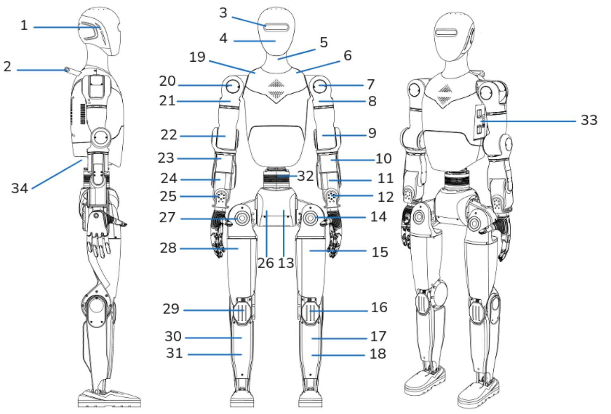

图中数字标识可按下表进⾏说明：  

<table><tr><td colspan="1" rowspan="1">序号</td><td colspan="1" rowspan="1">部位名称</td><td colspan="1" rowspan="1">说明</td></tr><tr><td colspan="1" rowspan="1">1</td><td colspan="1" rowspan="1">头部灯带</td><td colspan="1" rowspan="1">用于设备状态显示与交互提示</td></tr><tr><td colspan="1" rowspan="1">2</td><td colspan="1" rowspan="1">后背把手</td><td colspan="1" rowspan="1">用于机器人保护、转运和受控状态下的手持辅助</td></tr><tr><td colspan="1" rowspan="1">3</td><td colspan="1" rowspan="1">头部深度相机</td><td colspan="1" rowspan="1">用于环境感知、视觉识别与相关实验功能</td></tr><tr><td colspan="1" rowspan="1">4</td><td colspan="1" rowspan="1">头部旋转关节</td><td colspan="1" rowspan="1">用于控制头部左右转动，支撑视线方向调整与头部姿态控制</td></tr><tr><td colspan="1" rowspan="1">5</td><td colspan="1" rowspan="1">头部俯仰关节</td><td colspan="1" rowspan="1">用于控制头部前俯和后仰，支撑头部俯仰姿态调整</td></tr><tr><td colspan="1" rowspan="1">6</td><td colspan="1" rowspan="1">左肩俯仰关节</td><td colspan="1" rowspan="1">用于控制左臂前后摆动，是左上肢主要抬举关节之一</td></tr><tr><td colspan="1" rowspan="1">7</td><td colspan="1" rowspan="1">左肩横滚关节</td><td colspan="1" rowspan="1">用于控制左臂向身体侧向展开或收回</td></tr><tr><td colspan="1" rowspan="1">8</td><td colspan="1" rowspan="1">左肩偏航关节</td><td colspan="1" rowspan="1">用于控制左上臂绕轴旋转，配合完成复合手臂动作</td></tr><tr><td colspan="1" rowspan="1">9</td><td colspan="1" rowspan="1">左肘屈伸关节</td><td colspan="1" rowspan="1">用于控制左前臂弯曲和伸直</td></tr><tr><td colspan="1" rowspan="1">10</td><td colspan="1" rowspan="1">左腕偏航关节</td><td colspan="1" rowspan="1">用于控制左腕左右旋转，配合末端方向调整</td></tr><tr><td colspan="1" rowspan="1">11</td><td colspan="1" rowspan="1">左腕俯仰关节</td><td colspan="1" rowspan="1">用于控制左腕上抬和下压动作</td></tr><tr><td colspan="1" rowspan="1">12</td><td colspan="1" rowspan="1">左腕横滚关节</td><td colspan="1" rowspan="1">用于控制左腕横向翻转，提升末端姿态灵活性</td></tr><tr><td colspan="1" rowspan="1">13</td><td colspan="1" rowspan="1">左髋俯仰关节</td><td colspan="1" rowspan="1">用于控制左腿前摆和后摆，是步行动作的关键关节之一</td></tr><tr><td colspan="1" rowspan="1">14</td><td colspan="1" rowspan="1">左髋横滚关节</td><td colspan="1" rowspan="1">用于控制左腿侧向展开和重心横向调节</td></tr><tr><td colspan="1" rowspan="1">15</td><td colspan="1" rowspan="1">左髋偏航关节</td><td colspan="1" rowspan="1">用于控制左腿绕髋部旋转，配合转向和姿态调整</td></tr><tr><td colspan="1" rowspan="1">16</td><td colspan="1" rowspan="1">左膝屈伸关节</td><td colspan="1" rowspan="1">用于控制左膝弯曲和伸直，支撑站立、下蹲和行走动作</td></tr><tr><td colspan="1" rowspan="1">17</td><td colspan="1" rowspan="1">左踝俯仰关节</td><td colspan="1" rowspan="1">用于控制左脚前后倾角，配合步态落脚与重心控制</td></tr><tr><td colspan="1" rowspan="1">18</td><td colspan="1" rowspan="1">左踝横滚关节</td><td colspan="1" rowspan="1">用于控制左脚左右侧倾，配合平衡与地面适应</td></tr><tr><td colspan="1" rowspan="1">19</td><td colspan="1" rowspan="1">右肩俯仰关节</td><td colspan="1" rowspan="1">用于控制右臂前后摆动，是右上肢主要抬举关节之一</td></tr><tr><td colspan="1" rowspan="1">20</td><td colspan="1" rowspan="1">右肩横滚关节</td><td colspan="1" rowspan="1">用于控制右臂向身体侧向展开或收回</td></tr><tr><td colspan="1" rowspan="1">21</td><td colspan="1" rowspan="1">右肩偏航关节</td><td colspan="1" rowspan="1">用于控制右上臂绕轴旋转，配合完成复合手臂动作</td></tr><tr><td colspan="1" rowspan="1">22</td><td colspan="1" rowspan="1">右肘屈伸关节</td><td colspan="1" rowspan="1">用于控制右前臂弯曲和伸直</td></tr><tr><td colspan="1" rowspan="1">23</td><td colspan="1" rowspan="1">右腕偏航关节</td><td colspan="1" rowspan="1">用于控制右腕左右旋转，配合末端方向调整</td></tr><tr><td colspan="1" rowspan="1">24</td><td colspan="1" rowspan="1">右腕俯仰关节</td><td colspan="1" rowspan="1">用于控制右腕上抬和下压动作</td></tr><tr><td colspan="1" rowspan="1">25</td><td colspan="1" rowspan="1">右腕横滚关节</td><td colspan="1" rowspan="1">用于控制右腕横向翻转，提升末端姿态灵活性</td></tr><tr><td colspan="1" rowspan="1">26</td><td colspan="1" rowspan="1">右髋俯仰关节</td><td colspan="1" rowspan="1">用于控制右腿前摆和后摆，是步行动作的关键关节之一</td></tr><tr><td colspan="1" rowspan="1">27</td><td colspan="1" rowspan="1">右髋横滚关节</td><td colspan="1" rowspan="1">用于控制右腿侧向展开和重心横向调节</td></tr><tr><td colspan="1" rowspan="1">28</td><td colspan="1" rowspan="1">右髋偏航关节</td><td colspan="1" rowspan="1">用于控制右腿绕髋部旋转，配合转向和姿态调整</td></tr><tr><td colspan="1" rowspan="1">29</td><td colspan="1" rowspan="1">右膝屈伸关节</td><td colspan="1" rowspan="1">用于控制右膝弯曲和伸直，支撑站立、下蹲和行走动作</td></tr><tr><td colspan="1" rowspan="1">30</td><td colspan="1" rowspan="1">右踝俯仰关节</td><td colspan="1" rowspan="1">用于控制右脚前后倾角，配合步态落脚与重心控制</td></tr><tr><td colspan="1" rowspan="1">31</td><td colspan="1" rowspan="1">右踝横滚关节</td><td colspan="1" rowspan="1">用于控制右脚左右侧倾，配合平衡与地面适应</td></tr><tr><td colspan="1" rowspan="1">32</td><td colspan="1" rowspan="1">腰部偏航关节</td><td colspan="1" rowspan="1">位于躯干与下肢之间，用于控制腰部左右旋转，配合转向、平衡与上身姿态调整</td></tr><tr><td colspan="1" rowspan="1">33</td><td colspan="1" rowspan="1">电池仓</td><td colspan="1" rowspan="1">用于电池安装、更换及侧面接口操作</td></tr><tr><td colspan="1" rowspan="1">34</td><td colspan="1" rowspan="1">背部底下接口区</td><td colspan="1" rowspan="1">用于有线通信、调试连接及外部设备接入</td></tr></table>

# 1.3.1 头部

头部集成以下主要可识别部件：

深度相机

⻨克⻛阵列 扬声器 灯带

上述部件主要⽤于环境感知、语⾳交互、状态提⽰等功能。

# 1.3.2 上肢

左右上肢结构对称，每侧 7 ⾃由度。主要关节组成如下：

肩关节：俯仰、横滚、偏航肘关节：屈伸  
腕关节：偏航、俯仰、横滚末端：预留安装位

上肢主要⽤于动作演⽰、操作实验及扩展末端执⾏器安装。

# 1.3.3 下肢

左右下肢结构对称，每侧 6 ⾃由度。主要关节组成如下：

髋关节：俯仰、横滚、偏航 膝关节：屈伸 踝关节：俯仰、横滚

下肢系统主要⽤于站⽴、⾏⾛、转向、姿态调整与平衡控制。

# 1.3.4 躯⼲与电池仓

机⾝背部设置有把⼿，可⽤于受控状态下的⼈⼯作业辅助稳控、搬扶或配合阻尼状态操作。背部把⼿不应替代正式搬运⼯具或安全防护措施使⽤。

机⾝肩部设计有专⽤挂钩，便于机器⼈悬空吊运与转移。

机⾝设置有电池仓，⽤于安装和更换动⼒电池。电池本体带有电源开关和电量/状态指⽰灯，⽤⼾可据此完成上电前检查与电量确认。

# 1.3.5 背部底下接⼝区

机⾝背部底下设置接⼝区，当前已确认包含以下接⼝：

1个USB接⼝和1个Type-C接⼝   
2个有线⽹⼝

该区域主要⽤于有线通信、调试连接及外部设备接⼊。

# 1.3.6 急停装置说明

本产品急停装置为外接⼿持式⽆线急停器，不集成于机器⼈本体。⽤⼾在操作、调试、测试及演⽰过程中，应确保⽆线急停器处于随⼿可及、通信正常的状态，以便在异常情况下⽴即执⾏急停。

# 1.4 适⽤场景与限制说明

# 1.4.1 适⽤场景

本产品适⽤于科研院校的实验室算法验证、课堂教学演⽰、室内导航研究、⼈机交互研究及操作实验等场景。

# 1.4.2 限制说明

为确保⼈员与设备安全，本产品不适⽤于以下场景或使⽤⽅式：

湿滑、松软、严重不平整或存在明显空洞的地⾯环境  
⼈员密集且未设置安全隔离的环境中的⾼速运动、快速转向或⾃主导航测试  
强⾬、积⽔、冰雪、⼤⻛、强电磁⼲扰等不利环境条件  
载⼈、牵引⼈员或承载超出设计范围的外部负载  
易燃易爆、有毒有害、强腐蚀性物质接触或其他⾼危险作业场景  
未完成校准、⾃检异常、通信不稳定或操作⼈员⽆法随时接管时执⾏复杂动作或⾃主任务

⽤⼾应根据具体实验任务、场地条件和安全管理制度，对设备使⽤范围进⾏⼆次确认。

# 1.5 包装清单与配件说明

本产品标准交付内容可按合同或订单配置执⾏。当前版本可确认的包装清单如下：

<table><tr><td rowspan=1 colspan=1>序号</td><td rowspan=1 colspan=1>名称</td><td rowspan=1 colspan=1>数量</td><td rowspan=1 colspan=1>说明</td></tr><tr><td rowspan=1 colspan=1>1</td><td rowspan=1 colspan=1>机器人本体</td><td rowspan=1 colspan=1>1台</td><td rowspan=1 colspan=1>Z01双足人形机器人整机</td></tr><tr><td rowspan=1 colspan=1>2</td><td rowspan=1 colspan=1>电池</td><td rowspan=1 colspan=1>按合同/订单配置</td><td rowspan=1 colspan=1>可充电锂离子电池</td></tr><tr><td rowspan=1 colspan=1>3</td><td rowspan=1 colspan=1>充电器</td><td rowspan=1 colspan=1>1套</td><td rowspan=1 colspan=1>用于电池充电</td></tr><tr><td rowspan=1 colspan=1>4</td><td rowspan=1 colspan=1>无线急停器</td><td rowspan=1 colspan=1>1套</td><td rowspan=1 colspan=1>外接手持式无线急停装置</td></tr><tr><td rowspan=1 colspan=1>5</td><td rowspan=1 colspan=1>遥控器</td><td rowspan=1 colspan=1>1套</td><td rowspan=1 colspan=1>用于基础操作与控制</td></tr><tr><td rowspan=1 colspan=1>6</td><td rowspan=1 colspan=1>包装箱体</td><td rowspan=1 colspan=1>1套</td><td rowspan=1 colspan=1>用于运输和存放</td></tr><tr><td rowspan=1 colspan=1>7</td><td rowspan=1 colspan=1>使用说明书</td><td rowspan=1 colspan=1>1份</td><td rowspan=1 colspan=1>本文档</td></tr></table>

说明：

1. 实际交付内容以合同、订单、装箱单及产品配置清单为准。  
2. 如产品存在选配件、扩展模块或定制部件，应在正式交付⽂件中单独列明。

# 第⼆章 安全须知

本产品属于具备⾃主或半⾃主运动能⼒的双⾜⼈形机器⼈设备。在安装、调试、操作、维护及演⽰过程中，若使⽤不当，可能造成⼈员伤害、设备跌倒、部件损坏或实验环境⻛险。所有操作⼈员应在充分理解本说明书内容后再进⾏相关作业。

# 2.1 安全警⽰标识说明

本说明书采⽤以下安全警⽰等级：

危险（Danger）：若不避免，将导致严重⼈⾝伤害或重⼤设备损坏。  
警告（Warning）：若不避免，可能导致⼈⾝伤害或设备损坏。  
注意（Caution）：若不避免，可能导致轻微伤害、误操作或性能异常。  
提⽰（Notice）：⽤于补充操作要求、限制条件或建议事项。

在阅读和执⾏本说明书中的操作步骤时，⽤⼾应结合上述警⽰等级理解对应⻛险，并采取匹配的防护措施。

# 2.2 操作前安全检查清单

每次上电、测试、演⽰或运⾏前，应⾄少完成以下安全检查：

检查电池电量是否充⾜，电池安装是否牢固，电池开关及状态指⽰是否正常。  
检查⽆线急停器是否处于可⽤状态，并确认操作⼈员可随时触发急停。检查场地地⾯是否平整、⼲燥、⽆明显打滑⻛险或结构缺陷。检查机器⼈周边是否存在障碍物、悬空物、线缆、台阶边缘或⽆关⼈员。检查机体外观是否存在破损、松动、变形或异常碰撞痕迹。检查各关节活动区域是否存在异物卡阻⻛险。检查深度相机、激光雷达等传感器表⾯是否清洁，⽆遮挡、污渍或损伤。  
检查⽹络连接、遥控连接及必要的⼈机交互链路是否正常。  
检查系统⾃检结果是否正常，若存在异常提⽰，不得直接投⼊运⾏。

如任⼀检查项⽬未通过，应停⽌本次运⾏，待⻛险消除后再继续使⽤。

# 2.3 ⼈员安全距离与防护要求

在机器⼈调试、测试、演⽰和运⾏过程中，应设置必要的安全隔离区域，⾮操作⼈员不得进⼊机器⼈运⾏范围。操作⼈员应始终位于可观察、可接管、可即时触发⽆线急停的位置。

个⼈防护⽅⾯，建议执⾏以下要求：

操作⼈员应穿着防滑鞋。  
⻓发应束起，避免卷⼊运动部件或影响视线。  
不应穿着过于宽松的⾐物、围⼱或其他可能卷⼊设备的物品。  
在调试、⾸轮测试或⻛险较⾼的实验过程中，建议根据实际情况佩戴必要的防护⽤品。  
未经培训或未获得授权的⼈员不得独⽴操作本产品。

# 提⽰：

1. 当机器⼈执⾏快速动作、转向测试、⾃主导航或实验性算法验证时，应适当提⾼现场防护等级。  
2. 在存在摔倒⻛险的测试场景中，应提前明确操作分⼯、接管⽅式与急停责任⼈。

# 2.4 环境安全要求

为保证机器⼈稳定运⾏与⼈员安全，使⽤环境应满⾜以下基本要求：

地⾯应平整、坚实、⼲燥，避免湿滑、松软、碎⽯、线缆缠绕或明显起伏地⾯。  
在未明确验证前，不应在超出允许坡度范围的斜⾯、楼梯边缘或复杂⾼低差区域运⾏。  
机器⼈运⾏路径内不应存在明显障碍物、尖锐物、低矮绊倒物或突发移动⽬标。  
室外使⽤应限于受控条件下的平整地⾯，不应在强⾬、积⽔、冰雪、⼤⻛等天⽓环境中使⽤。  
环境照明应满⾜相机、视觉识别及安全观察需求，避免强逆光、频闪、极暗环境或严重光照突变。  
⽹络与通信环境应保持稳定，特别是在涉及远程监控、遥控接管、数据传输或协同控制时，不得在链路明显不稳定的情况下执⾏⾼⻛险动作。

# 注意：

1. 环境条件不达标时，可能导致感知误差、步态异常、定位失败、控制延迟或跌倒⻛险上升。  
2. 当场地或环境状态发⽣变化时，应重新执⾏安全检查，⽽⾮沿⽤上⼀次测试条件。

# 2.5 紧急情况处置与急停操作

⼀旦出现失稳、误动作、通信失控、⼈员闯⼊危险区或环境异常，操作⼈员应⽴即按下⽆线急停器，并在机器⼈完全停⽌后再接近设备。

本产品使⽤外接⼿持式⽆线急停器作为紧急处置装置。⽆线急停主要⽤于紧急危险、失控或⾼⻛险异常场景，其动作逻辑为直接下电。触发急停后，机器⼈可能因失去动⼒⽀撑⽽直接摔倒。因此，⽆线急停应仅在必须⽴即切断动⼒、优先避免⼈员⻛险或扩⼤损失时使⽤。

急停后的标准处置流程如下：

1. ⽴即触发⽆线急停。  
2. 确认机器⼈停⽌运动，并与设备保持安全距离。  
3. 排查⼈员、场地、电源、通信和机械状态，确认是否存在⼆次⻛险。  
4. 在未查明故障原因或⻛险未解除前，不得强⾏复位或继续运⾏。  
5. 由具备权限的⼈员按照规范解除急停，并重新完成上电、⾃检及安全确认后再恢复使⽤。

危险（Danger）：

⽆线急停触发后机器⼈可能直接跌倒，周边⼈员不得在机器⼈倒向区域内停留。  
不得将急停视作常规停机⼿段，不得在⾮紧急场景下频繁使⽤急停替代正常控制流程。

# 2.6 故障状态下的安全姿态

本产品在故障、异常处置或⼈⼯接管过程中，不保证⾃动进⼊安全站⽴姿态。不同处置⽅式对应的状态和⻛险不同，操作⼈员必须明确区分。

# 2.6.1 ⽆线急停后的状态

⽆线急停触发后，机器⼈直接下电，可能失去⽀撑并发⽣摔倒。该⽅式适⽤于失控、碰撞⻛险、⼈员危险或其他需要⽴即切断动⼒的场景，不适⽤于⽇常调姿、常规停机或普通实验切换。

# 2.6.2 阻尼状态下的⻛险说明

本产品⽀持通过遥控器组合按键使机器⼈进⼊阻尼状态。进⼊阻尼状态后，机器⼈同样可能因失去主动⽀撑能⼒⽽发⽣摔倒。因此，阻尼状态仅适⽤于⼈为可控场景，例如：

机器⼈已处于吊钩保护状态。  
操作⼈员已稳固握持机器⼈背部把⼿并具备可靠控制条件。

警告（Warning）：

在⽆⼈保护、⽆吊挂或⽆⼈⼯稳定控制的情况下，不得使机器⼈进⼊阻尼状态。  
阻尼状态不能等同于安全姿态，其本质上仍属于需⼈⼯保护的过渡状态。

提⽰（Notice）：

进⼊阻尼或急停后，应优先评估机器⼈⽀撑状态、周边空间及⼈员站位，防⽌⼆次碰撞或夹伤。  
若需在故障后重新扶正或搬扶机器⼈，应由经过培训的⼈员执⾏，并结合现场保护条件谨慎操作。

# 第三章 安装与初始化

本产品采⽤整机交付⽅式，⽤⼾⽆需进⾏复杂装配。⾸次使⽤前，应按照本章要求完成开箱检查、电池安装、充电、⽹络连接及基础初始化确认。

# 3.1 开箱检查

由于本产品为整机交付，⽤⼾开箱后的主要任务是完成设备检查与安全就位，⽽⾮复杂组装。

建议按以下流程操作：

1. 检查外包装箱体是否存在明显破损、受潮、倾倒或撞击痕迹。  
2. 按照规范打开包装箱，核对随机附件与包装清单是否⻬全。  
3. 检查机器⼈本体外观是否存在结构损伤、部件松动、线缆脱落或运输异常痕迹。  
4. 将机器⼈从包装中取出后，转移⾄平整、开阔、安全的测试区域。

机器⼈就位时，应由⾄少两⼈配合搬运或扶持，必要时结合吊装保护。不得单⼈强⾏搬运，不得通过拖拽下肢、抓提关节部位或其他不规范⽅式移动设备。

提⽰（Notice）：

开箱后如发现外观损坏、附件缺失或部件异常，应暂停使⽤并进⾏记录。  
设备⾸次就位后，建议先完成静态检查，再进⾏电池安装与上电操作。

# 3.2 开箱步骤

打开包装箱，检查随机附件；

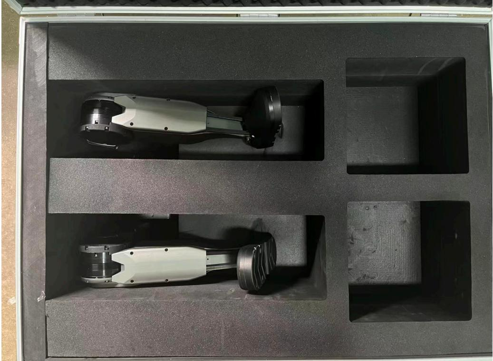

拿出泡棉，扶住双腿以免腿部弯曲砸坏机器⼈躯⼲的覆盖件；

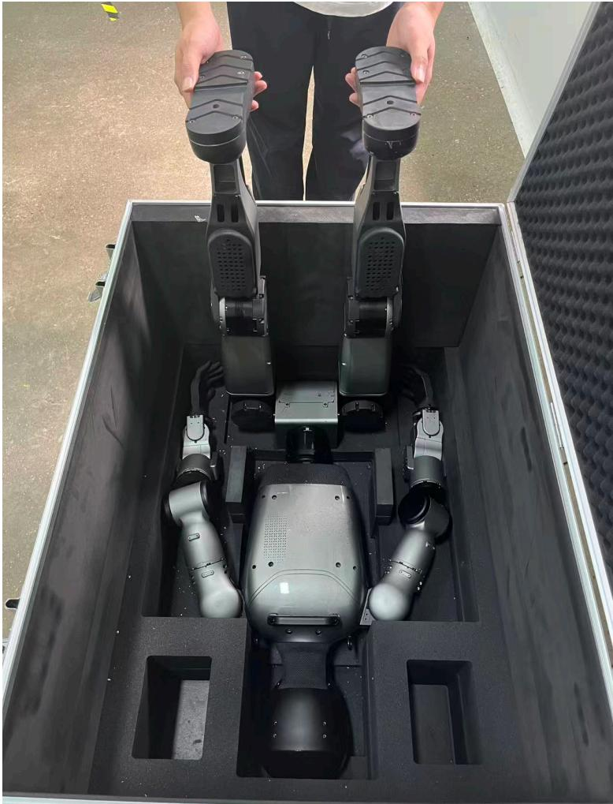

将吊机的挂钩勾住机器⼈肩部的扣环；

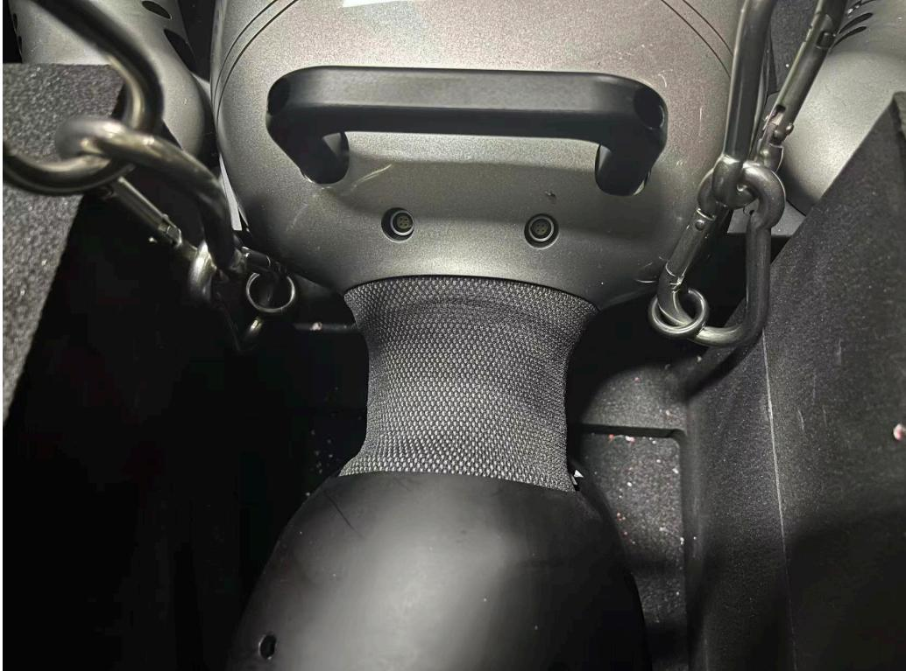

将吊机吊起，同时扶住机器⼈的双腿，使机器⼈⾼于箱体后，将包装箱移开；

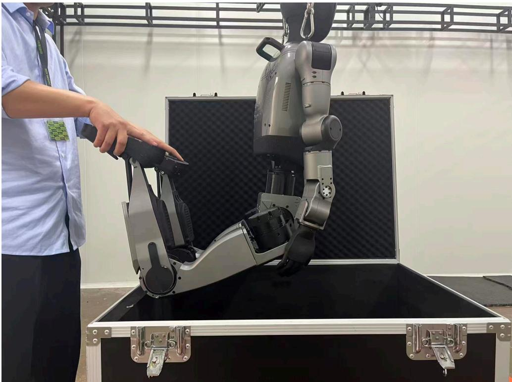

将机器⼈悬空吊起，保持各个关节位置处于垂直⾃然的零位附近；

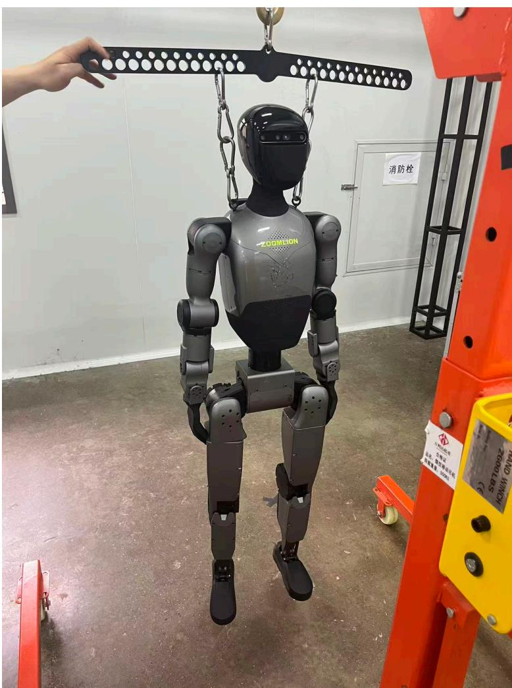

# 3.2 电池安装与充电规范

# 3.2.1 电池安装

本产品使⽤可充电锂离⼦电池，额定电压为 $4 6 . 8 \vee$ ，额定容量为 449.28 Wh，⽀持热拔插。安装电池时，应确认电池⽅向正确。

电池安装要求如下：

1. 确认机器⼈处于安全静⽌状态。  
2. 检查电池外观完好，⽆破损、⿎包、异味或异常发热现象。  
3. 确保电池指⽰灯位于电池左侧的正确⽅向。  
4. 从躯⼲左侧电池仓将电池平稳插⼊。  
5. 电池插⼊后，应听到卡扣到位声。  
6. 确认卡扣的上下拉扣位置均已顶到边缘，且电池与舱体结合处⽆明显缝隙。

若电池未安装到位，不得执⾏上电和运⾏操作。

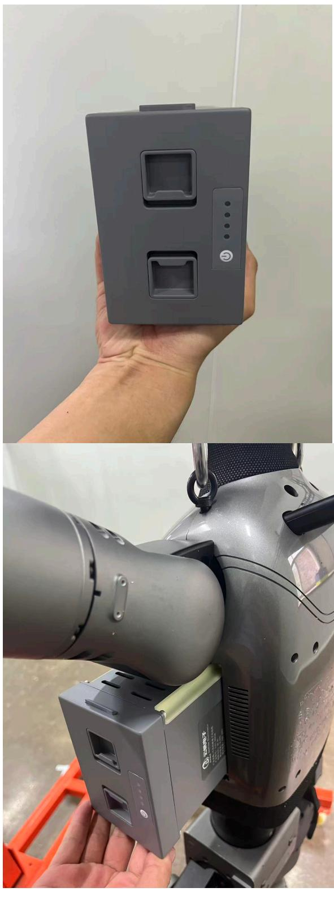

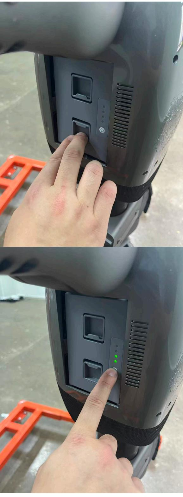

# 3.2.2 电池上电与断电

⻓按电池开关可进⾏上电和断电操作。机器⼈整机通过电池开关启动，不设独⽴机⾝总电源按钮。  
在断电或拆卸电池前，应确保机器⼈已处于安全静⽌状态，且周边具备⾜够安全空间。

# 3.2.3 电池拆卸

拆卸电池时，应按以下顺序进⾏：

1. ⻓按电池开关，确认电池断电。

2. 拉开卡扣。  
3. 平稳抽出电池。

拆卸过程中应避免冲击、跌落、卡滞或带载强⾏抽拔。

# 3.2.4 充电规范

本产品电池应拆下后单独充电，不建议在机器⼈装载状态下进⾏充电。

充电时应按以下顺序操作：

1. 先连接电池。  
2. 再连接市电。

充电状态可通过电池和充电器指⽰灯进⾏判断：

电池指⽰灯共 4 格，4 格全亮表⽰电池已充满。  
充电器指⽰灯为红⾊时表⽰充电中。  
充电器指⽰灯为绿⾊时表⽰已充满。

注意（Caution）：

充电应在通⻛良好、⼲燥、安全的环境中进⾏。  
若发现充电异常、指⽰灯状态异常、电池明显发热或其他异常现象，应⽴即停⽌充电并检查原因。

# 3.3 ⽹络配置

本产品当前版本⽆账⼾绑定要求，初始化过程主要涉及⽹络连接与远程登录配置。

# 3.3.1 有线⽹络连接

机器⼈设有两个有线⽹⼝，默认使⽤靠近机器⼈中间的⽹⼝。默认 IP 地址为 192.168.12.100 。

操作⼈员可通过有线⽹络将计算机与机器⼈连接，并进⾏调试、远程访问及⽹络配置操作。

# 3.3.2 远程登录

⽤⼾可通过 NoMachine 软件远程登录机器⼈系统。当前默认 Ubuntu 账⼾信息如下：

⽤⼾名： zl密码： admin

⾸次接⼊后，建议由管理⼈员根据实际管理要求决定是否修改默认密码，⾮管理⼈员不得随意更改。

# 3.3.3 ⽆线⽹络配置

机器⼈具备 Wi-Fi 功能。操作⼈员可在完成有线连接并登录系统后，根据实际使⽤环境⾃⾏配置需要连接的⽆线⽹络。

提⽰（Notice）：

说明书中的⽹络参数应以正式交付版本为准。  
本⽂档不包含开发阶段临时路由配置或内部测试⽹络参数。

# 3.4 固件升级与校准

当前版本⾯向普通⽤⼾的使⽤说明中，不包含固件升级操作。⽤⼾不应⾃⾏执⾏固件升级。

机器⼈出⼚前已完成零位标定与基础校准。若设备在⻓期使⽤后出现零位偏差问题，可由具备条件的⼈员配合专⽤标零⼯具进⾏重新标零。

提⽰（Notice）：

标零操作具有专业性和⻛险性，不属于普通⽤⼾⽇常初始化流程。  
具体标零⽅法建议在后续单独技术章节或专⻔技术⽂档中说明。

# 第四章 基本操作指南

# 4.1 开机与关机

本产品当前⽆待机或唤醒机制，基本电源操作仅包括上电开机和断电关机。

# 4.1.1 开机

机器⼈通过电池开关启动整机。每次开机都会⾃动执⾏关节⾃检。

开机流程如下：

1. 确认机器⼈已完成运⾏前条件检查，周边环境满⾜第⼆章安全要求。  
2. ⻓按电池开关进⾏上电。  
3. 观察机器⼈头部是否点亮。  
4. 确认⻛扇启动，可通过声响判断系统已进⼊启动过程。  
5. 等待机器⼈⾃动执⾏关节⾃检。  
6. 根据系统提⽰判断⾃检结果。

正常情况下，系统会提⽰⾃检成功。若存在以下情况，则可能提⽰⾃检失败：

关节通信断开。  
关节当前位置与关节零位⻆度差过⼤，超过 $\boldsymbol { 1 3 5 ^ { \circ } }$ 。

若系统提⽰⾃检失败，不得强⾏进⼊运⾏状态。此时应⽴即停⽌后续操作，检查关节通信、机器⼈姿态及周边安全条件；必要时执⾏断电，并由具备条件的⼈员进⼀步处理。

开机后的关节⾃检结果，也可通过机器⼈控制⾯板中的“关节状态”区域进⾏辅助观察。关节状态正常时显⽰为绿⾊，关节超限时显⽰为⻩⾊，关节断连时显⽰为红⾊。

警告（Warning）：

⾃检失败状态下继续操作，可能引发姿态异常、误动作或跌倒⻛险。

对异常关节、通信故障或零位偏差未查明原因前，不得执⾏步⾏、起⽴或其他动态动作。

# 4.1.2 关机

机器⼈通过⻓按电池开关执⾏断电关机。关机前应确保机器⼈已停⽌当前动作，并处于安全、可控状态。

注意（Caution）：

不得在机器⼈执⾏⾼⻛险动作、处于不稳定⽀撑状态或周边⼈员未撤离时直接断电关机。  
紧急危险场景下应优先按照第⼆章要求使⽤⽆线急停器，⽽⾮将正常关机操作替代急停处置。

# 4.2 本地控制⾯板操作

本产品⽀持通过浏览器访问机器⼈控制⾯板进⾏状态查看和基础控制。操作⼈员可在计算机端通过访问机器⼈有线 IP或⽆线 IP，并在地址后添加端⼝ 8088 打开控制⻚⾯。

# ⽰例：

http://192.168.12.100:8088

# 机器人控制面板

# 系统状态

# 电池状态

# 控制面板

# 执行动作

# 语音播报

你好！我是机器人

# 播报

# IMU状态

<table><tr><td>加速度</td><td>陀螺仪</td></tr><tr><td>X 5.8959</td><td>X -0.0990</td></tr><tr><td>0.7415</td><td>0.0350</td></tr><tr><td>Z 1.7060</td><td>Z 0.0406</td></tr></table>

# 关节状态

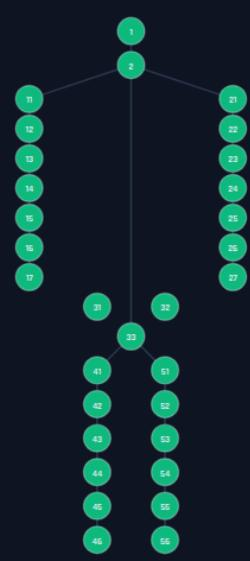

# 四元数

q 0.930465  
q1 -0.019191  
q2 -0.322150  
q3 -0.173447

# 系统日志

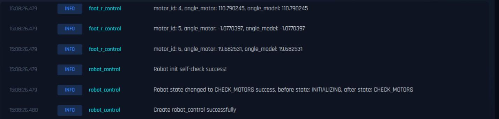

机器⼈控制⾯板主要分为以下⼏个区域：

系统状态电池状态控制⾯板执⾏动作语⾳播报IMU 状态关节状态系统⽇志

# 4.2.1 系统状态

系统状态区域⽤于显⽰主控板运⾏信息，主要包括：

CPU 使⽤情况内存使⽤情况磁盘使⽤情况⽹络接收数据⽹络发送数据

该区域可⽤于判断主控计算资源占⽤情况和⽹络通信状态是否正常。

# 4.2.2 电池状态

电池状态区域⽤于显⽰当前电池相关信息，主要包括：

电池电压电池电流剩余电量充电状态

操作⼈员可据此判断电池供电状态和剩余可⽤时间，并辅助确认是否适合继续运⾏。

# 4.2.3 控制⾯板

控制⾯板区域提供四个主要按钮，⽤于执⾏机器⼈模式切换或状态控制：

准备：控制机器⼈进⼊准备状态进⼊模型：控制机器⼈进⼊模型运⾏状态进⼊阻尼：控制机器⼈进⼊阻尼状态重置初始化：执⾏重置初始化操作

警告（Warning）：

进⼊阻尼状态前，应确认机器⼈具备吊装保护或⼈⼯稳定控制条件，否则机器⼈可能失去⽀撑并摔倒。  
模式切换操作应在场地安全、⼈员可接管且机器⼈状态正常的前提下执⾏。

# 4.2.4 执⾏动作

执⾏动作区域包含两类控制内容：

运动控制：例如前进、后退、左转、右转等基础运动控制动作控制：例如预设动作按钮，⽤于触发指定动作演⽰

执⾏动作前，应确认机器⼈已进⼊合适的控制状态，且运⾏空间满⾜安全要求。

# 4.2.5 语⾳播报

语⾳播报区域可⽤于执⾏机器⼈语⾳输出测试，从⽽辅助验证语⾳链路和扬声器⼯作是否正常。

# 4.2.6 IMU 状态

IMU 状态区域⽤于实时查看机器⼈ IMU 传感器数据是否正常，通常包括加速度、陀螺仪、欧拉⻆或四元数等信息。该区域可辅助判断姿态估计与惯性测量状态是否异常。

# 4.2.7 关节状态

关节状态区域⽤于实时查看各关节运⾏状态是否正常，并可辅助判断开机⾃检结果。状态颜⾊说明如下：

绿⾊：关节状态正常 ⻩⾊：关节超限 红⾊：关节断连

当关节状态出现⻩⾊或红⾊提⽰时，不得贸然执⾏动态动作，应优先排查对应故障原因。

# 4.2.8 系统⽇志

系统⽇志区域⽤于显⽰机器⼈运⾏过程中的⽇志信息，可辅助查看模块启动、⾃检结果、状态切换和异常提⽰等内容。

提⽰（Notice）：

当出现异常时，建议优先结合系统⽇志、关节状态和 IMU 状态综合判断问题来源。  
控制⾯板功能和界⾯布局可能随着软件版本变化进⾏调整，实际以正式交付版本为准。

# 4.3 遥控器/⼿柄操作说明

本产品配套遥控器可⽤于执⾏模式切换、运⾏准备、模型进⼊、阻尼切换、系统重置及运动控制等操作。为避免误操作，涉及状态切换的关键功能均采⽤组合按键⽅式触发。

提⽰（Notice）：

遥控器不替代⽆线急停器。 $\mathsf { L B } + \mathsf { R B } + \mathsf { Y }$ 的功能为进⼊阻尼模式，不等同于⽆线急停。  
执⾏模式切换前，应确认机器⼈状态、场地安全条件和⼈员站位满⾜要求。

# 4.3.1 遥控器正⾯按键标注说明

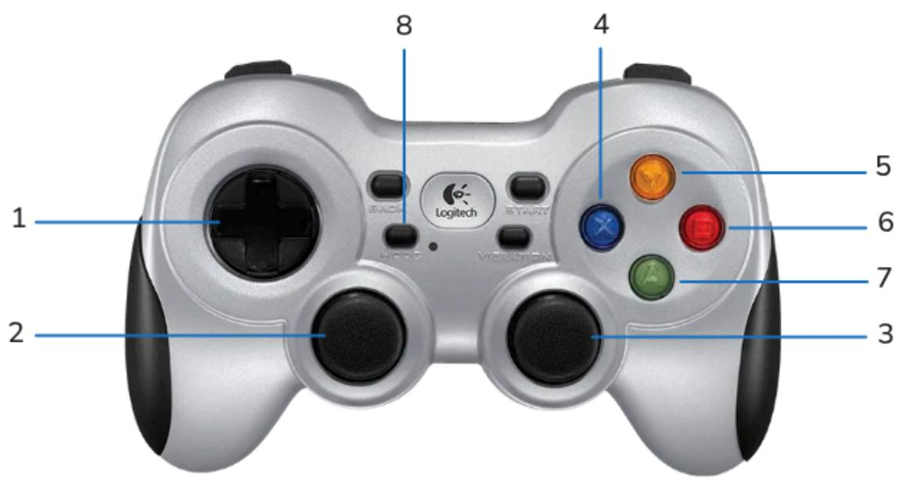

<table><tr><td rowspan=1 colspan=1>序号</td><td rowspan=1 colspan=1>按键名称</td><td rowspan=1 colspan=1>说明</td></tr><tr><td rowspan=1 colspan=1>1</td><td rowspan=1 colspan=1>方向键</td><td rowspan=1 colspan=1>与LB/RB/LB+RB组合按键配合，用于执行不同动作</td></tr><tr><td rowspan=1 colspan=1>2</td><td rowspan=1 colspan=1>左摇杆</td><td rowspan=1 colspan=1>用于运动控制输入，具体映射见后续控制说明</td></tr><tr><td rowspan=1 colspan=1>3</td><td rowspan=1 colspan=1>右摇杆</td><td rowspan=1 colspan=1>用于运动控制输入，具体映射见后续控制说明</td></tr><tr><td rowspan=1 colspan=1>4</td><td rowspan=1 colspan=1>×按键 (蓝色)</td><td rowspan=1 colspan=1>与LB+RB组合按键配合，用于执行重置初始化</td></tr><tr><td rowspan=1 colspan=1>5</td><td rowspan=1 colspan=1>Y按键 (黄色)</td><td rowspan=1 colspan=1>与LB+RB组合按键配合，用于进入阻尼模式</td></tr><tr><td rowspan=1 colspan=1>6</td><td rowspan=1 colspan=1>B按键 (红色)</td><td rowspan=1 colspan=1>与LB+RB组合按键配合，用于进入行走模型</td></tr><tr><td rowspan=1 colspan=1>7</td><td rowspan=1 colspan=1>A按键 (绿色)</td><td rowspan=1 colspan=1>与LB+RB组合按键配合，用于进入准备状态</td></tr><tr><td rowspan=1 colspan=1>8</td><td rowspan=1 colspan=1>模式按键</td><td rowspan=1 colspan=1>需确保模式指示灯处于熄灭</td></tr></table>

# 4.3.2 遥控器侧⾯按键标注说明

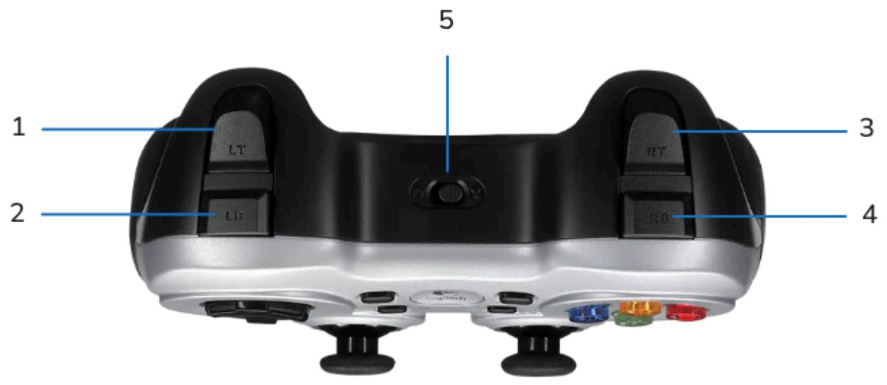

<table><tr><td rowspan=1 colspan=1>序号</td><td rowspan=1 colspan=1>按键名称</td><td rowspan=1 colspan=1>说明</td></tr><tr><td rowspan=1 colspan=1>1</td><td rowspan=1 colspan=1>LT</td><td rowspan=1 colspan=1>左侧扳机键</td></tr><tr><td rowspan=1 colspan=1>2</td><td rowspan=1 colspan=1>LB</td><td rowspan=1 colspan=1>左侧肩键</td></tr><tr><td rowspan=1 colspan=1>3</td><td rowspan=1 colspan=1>RT</td><td rowspan=1 colspan=1>右侧扳机键</td></tr><tr><td rowspan=1 colspan=1>4</td><td rowspan=1 colspan=1>RB</td><td rowspan=1 colspan=1>右侧肩键</td></tr><tr><td rowspan=1 colspan=1>5</td><td rowspan=1 colspan=1>档位按键 (D 模式/X 模式)</td><td rowspan=1 colspan=1>需确保档位按键处于D模式</td></tr></table>

# 4.3.3 机器⼈准备与运⾏流程

使⽤遥控器控制机器⼈进⼊运⾏状态时，建议按以下流程操作：

1. 机器⼈默认处于悬吊状态。系统开机后⾸先进⾏关节状态⾃检，系统会提⽰“⾃检成功”或“⾃检失败”。  
2. 等待提⽰“⾃检成功”后，按下组合按键 $\mathsf { L B } \ + \ \mathsf { R B } \ + \ \mathsf { A }$ ，机器⼈进⼊准备状态。完成后系统会提⽰“准备完成”。  
3. 等待准备完成后，将机器⼈放下并确认站稳，再按下组合按键 $\mathsf { L B } \ + \ \mathsf { R B } \ + \ \mathsf { B }$ ，机器⼈进⼊⾏⾛模型（强化学习）。  
4. 机器⼈进⼊⾏⾛模型后，可通过遥控组合按键进⾏模型动作或者舞蹈切换。动作或者舞蹈执⾏完成后，机器⼈⾃动返回⾏⾛模型。  
5. 如需退出当前运⾏状态，应先将机器⼈置于吊机挂钩勾上的保护状态（⾮悬吊状态），再按下组合按键$\angle B + \mathsf { R B } + \mathsf { Y }$ ，使机器⼈进⼊阻尼模式。进⼊阻尼后，机器⼈会卸⼒下落。  
6. 如需重新操作，应先将机器⼈重新置于悬吊状态，再按下组合按键 $\angle B + \mathsf { R B } + \mathsf { X }$ ，系统执⾏重置初始化，之后可重新从准备步骤开始操作。

警告（Warning）：

$\angle B + \mathsf { R B } + \mathsf { Y }$ 进⼊阻尼模式前，必须确认机器⼈具备吊装保护或⼈⼯稳定控制条件，否则机器⼈可能直接失去⽀撑并摔倒。$\mathsf { L B } \ + \ \mathsf { R B } \ + \ \mathsf { B }$ 进⼊⾏⾛模型前，必须确认机器⼈已完成准备状态、已放下站稳且场地具备运⾏条件。  
⾃检失败时，不得继续执⾏准备、进⼊模型或动作切换操作。

# 4.3.4 状态切换类组合按键

<table><tr><td rowspan=1 colspan=1>组合按键</td><td rowspan=1 colspan=1>功能</td><td rowspan=1 colspan=1>使用条件</td></tr><tr><td rowspan=1 colspan=1>LB + RB+A</td><td rowspan=1 colspan=1>进入准备状态</td><td rowspan=1 colspan=1>自检成功，机器人处于悬吊保护状态</td></tr><tr><td rowspan=1 colspan=1>LB + RB +B</td><td rowspan=1 colspan=1>进入行走模型 (强化学习)</td><td rowspan=1 colspan=1>准备完成，机器人已放下并站稳</td></tr><tr><td rowspan=1 colspan=1>LB + RB + Y</td><td rowspan=1 colspan=1>进入阻尼模式</td><td rowspan=1 colspan=1>机器人处于吊机挂钩保护或人工稳定控制条件下</td></tr><tr><td rowspan=1 colspan=1>LB + RB + X</td><td rowspan=1 colspan=1>重置初始化</td><td rowspan=1 colspan=1>机器人重新置于悬吊状态后执行</td></tr></table>

# 4.3.5 单动作交互类组合按键

<table><tr><td rowspan=1 colspan=1>组合按键</td><td rowspan=1 colspan=1>功能</td><td rowspan=1 colspan=1>使用条件</td></tr><tr><td rowspan=1 colspan=1>LB+方向键左</td><td rowspan=1 colspan=1>触发打招呼动作 (连续)</td><td rowspan=1 colspan=1>再次按下相同组合按键，可停止打招呼动作</td></tr><tr><td rowspan=1 colspan=1>LB + 方向键上</td><td rowspan=1 colspan=1>触发鼓掌动作 (连续)</td><td rowspan=1 colspan=1>再次按下相同组合按键，可停止鼓掌动作</td></tr><tr><td rowspan=1 colspan=1>LB + 方向键右</td><td rowspan=1 colspan=1>触发蹲起动作</td><td rowspan=1 colspan=1>机器人需处于下蹲状态，蹲起后自动进入行走模式</td></tr><tr><td rowspan=1 colspan=1>LB +方向键下</td><td rowspan=1 colspan=1>触发下蹲动作</td><td rowspan=1 colspan=1>机器人需处于站立状态，可下蹲坐在躺椅，随后进入阻尼模式</td></tr><tr><td rowspan=1 colspan=1>RB+方向键左</td><td rowspan=1 colspan=1>触发比心动作</td><td rowspan=1 colspan=1>机器人需处于行走模式下的站立状态</td></tr><tr><td rowspan=1 colspan=1>RB +方向键上</td><td rowspan=1 colspan=1>触发敬礼动作</td><td rowspan=1 colspan=1>机器人需处于行走模式下的站立状态</td></tr><tr><td rowspan=1 colspan=1>RB + 方向键右</td><td rowspan=1 colspan=1>触发握手动作</td><td rowspan=1 colspan=1>机器人需处于行走模式下的站立状态</td></tr><tr><td rowspan=1 colspan=1>RB +方向键下</td><td rowspan=1 colspan=1>触发击掌动作</td><td rowspan=1 colspan=1>机器人需处于行走模式下的站立状态</td></tr></table>

# 4.3.6 舞蹈/组合表演类组合按键

<table><tr><td rowspan=1 colspan=1>组合按键</td><td rowspan=1 colspan=1>功能</td><td rowspan=1 colspan=1>使用条件</td></tr><tr><td rowspan=1 colspan=1>LB + RB+ 方向键左</td><td rowspan=1 colspan=1>触发动太极舞蹈</td><td rowspan=1 colspan=1>机器人需处于行走模式下的站立状态</td></tr><tr><td rowspan=1 colspan=1>LB + RB + 方向键上</td><td rowspan=1 colspan=1>触发静太极舞蹈</td><td rowspan=1 colspan=1>机器人需处于行走模式下的站立状态</td></tr><tr><td rowspan=1 colspan=1>LB + RB+方向键右</td><td rowspan=1 colspan=1>触发滑步舞蹈</td><td rowspan=1 colspan=1>机器人需处于行走模式下的站立状态</td></tr><tr><td rowspan=1 colspan=1>LB + RB + 方向键下</td><td rowspan=1 colspan=1>触发相亲相爱舞蹈</td><td rowspan=1 colspan=1>机器人需处于行走模式下的站立状态</td></tr></table>

# 4.4 基础控制指令

本节仅说明机器⼈在⾏⾛模式下的基础运动控制⽅式。ROS 指令控制、⽹⻚控制和⾼级动作编排不在本节展开。

# 4.4.1 ⾏⾛与转向控制

当机器⼈已进⼊⾏⾛模式后，可通过遥控器左右摇杆进⾏直接控制，具体映射如下：

左摇杆前推：控制机器⼈前进左摇杆后拉：控制机器⼈后退左摇杆左推：控制机器⼈向左横向移动左摇杆右推：控制机器⼈向右横向移动右摇杆左推：控制机器⼈向左⾃旋右摇杆右推：控制机器⼈向右⾃旋右摇杆前后⽅向：当前版本不处理

# 4.4.2 停⽌控制

当需要停⽌机器⼈运动时，应将左右摇杆回中，使机器⼈退出当前运动输⼊并恢复稳定站⽴状态。

注意（Caution）：

停⽌控制适⽤于正常运动过程中的减速和停稳，不替代⽆线急停或阻尼处置。  
若机器⼈出现异常失稳、误动作或周边突发危险，应优先按照第⼆章要求执⾏紧急处置。

# 4.4.3 蹲下与起⽴说明

蹲下和蹲起不作为基础摇杆运动控制处理，⽽通过遥控器组合按键触发，具体如下：

LB $^ +$ ⽅向键下 ：触发下蹲动作。机器⼈需处于站⽴状态，可下蹲坐在躺椅，随后进⼊阻尼模式。  
LB $^ +$ ⽅向键右 ：触发蹲起动作。机器⼈需处于下蹲状态，完成蹲起后⾃动进⼊⾏⾛模式。

执⾏蹲下或蹲起动作前，应确认机器⼈周边空间充⾜、⽀撑条件可靠，且⽆⼈员处于潜在碰撞范围内。

# 第五章 运动控制与导航

本章主要说明机器⼈在⾏⾛模式下的运动控制⽅式、控制模式切换及与导航相关的基础接⼝约束。涉及更复杂的⾃主导航算法、路径规划策略和⾼级感知能⼒时，应结合实际软件版本与项⽬配置进⼀步确认。

# 5.1 步态模式选择

当前版本已明确⽀持基于⾏⾛模型的双⾜运动控制。机器⼈在完成准备状态并站稳后，可进⼊⾏⾛模型（强化学习）执⾏前进、横移和⾃旋等基础运动。

提⽰（Notice）：

本说明书当前版本未对快⾛、上下楼梯、斜坡⾏⾛等扩展步态进⾏详细展开。  
若后续版本⽀持更多步态模式，建议在正式发布时补充对应的使⽤条件、速度范围和⻛险说明。

# 5.2 路径规划与⾃主导航设置

机器⼈⽀持两种基础控制模式：

遥控模式导航模式

默认控制模式为遥控模式。通过按住 RT 并连续按 3 次 LT ，可在遥控模式和导航模式之间切换；重复相同操作可切换回原模式。

模式切换规则如下：

遥控模式：只接收⾃定义消息控制。  
导航模式：只接收 cmd_vel 消息控制。

在导航模式下，可通过 ROS 话题 /cmd_vel 发送 geometry_msgs/Twist 消息进⾏运动控制。⽰例如下：

ros2 topic pub /cmd_vel geometry_msgs/Twist "linear:

x: 0.0y: 0.0z: 0.0angular:x: 0.0y: 0.0z: 0.3" --once注意（Caution）：

在切换控制模式前，应明确当前控制链路和接管责任，避免因模式不⼀致导致指令⽆效或误判。  
路径规划算法、地图构建⽅式和⾃主导航任务编排不在当前说明书版本展开，后续可根据软件版本补充。

# 5.3 避障与环境感知功能

机器⼈具备深度相机、激光雷达和 IMU 等传感器，可为环境感知、姿态估计和运动控制提供基础数据⽀持。

当前版本说明如下：

深度相机主要⽤于近距离环境感知和视觉相关任务。  
激光雷达可为环境探测和导航相关功能提供数据基础。  
IMU ⽤于姿态、加速度和⻆速度信息获取，可通过控制⾯板实时查看状态。

提⽰（Notice）：

避障策略的触发逻辑、阈值设置和算法⾏为与具体软件版本有关，正式交付时应以实际版本说明为准。  
在未充分验证避障能⼒前，不应将机器⼈直接投⼊复杂⼈群环境或⾼⻛险开放场景。

# 5.4 跌倒检测与⾃我保护机制

当前版本说明书中，不对机器⼈跌倒后⾃主恢复、⾃动保护动作或起⾝策略作统⼀承诺。机器⼈在紧急下电、阻尼切换或异常失稳情况下，均存在失去⽀撑并摔倒的⻛险。

⽤⼾应重点遵守以下原则：

⽆线急停仅⽤于紧急危险场景，触发后机器⼈可能直接摔倒。  
进⼊阻尼模式前，必须具备吊装保护或⼈⼯稳定控制条件。  
在⾼⻛险测试或算法验证场景中，应优先配置外部保护措施，⽽⾮依赖机器⼈⾃动保护能⼒。

# 5.5 ⼿动接管与运动限制设置

# 5.5.1 ROS ⾃定义消息运动控制

在遥控模式下，机器⼈接收 /inner_motion_cmd 话题上的⾃定义消息 robot_msgs/msg/RemoteControlMotion 进⾏运动控制。⽰例如下：

ros2 topic pub /inner_motion_cmd robot_msgs/msg/RemoteControlMotion "{token: '', vx: 0.5, vy: 0.0, v

# 常⽤⽰例如下：

# 向前移动ros2 topic pub /inner_motion_cmd robot_msgs/msg/RemoteControlMotion "{token: '', vx: 0.5, vy: 0.0, v

# 向后移动

ros2 topic pub /inner_motion_cmd robot_msgs/msg/RemoteControlMotion "{token: '', vx: -0.5, vy: 0.0,

# 向左移动 ros2 topic pub /inner_motion_cmd robot_msgs/msg/RemoteControlMotion "{token: '', vx: 0.0, vy: 0.5, v

# 向右移动

ros2 topic pub /inner_motion_cmd robot_msgs/msg/RemoteControlMotion "{token: '', vx: 0.0, vy: -0.5,

# 向左转动

ros2 topic pub /inner_motion_cmd robot_msgs/msg/RemoteControlMotion "{token: '', vx: 0.0, vy: 0.0, v

# 向右转动

ros2 topic pub /inner_motion_cmd robot_msgs/msg/RemoteControlMotion "{token: '', vx: 0.0, vy: 0.0, v

# 字段说明如下：

token ：当前版本暂未使⽤。  
vx ：前进/后退速度值，范围为 -0.5 \~ 1.0 m/s 。  
vy ：左移/右移速度值，范围为 -0.5 \~ 0.5 m/s 。  
vyaw ：左右⾃旋速度值，范围为 -1.5 \~ 1.5 。  
gait_step ：步态参数，默认值为 1.0 ，当前版本可保持默认。

is_continous ：速度维持标志。 false 表⽰接收单次速度控制指令； true 表⽰机器⼈持续使⽤当前速度指令。

注意（Caution）：

is_continous $=$ true 的危险度较⾼，当前建议普通⽤⼾不要使⽤。  
上述⽰例中的 0.5 或 -0.5 仅为参考值，实际应结合场地条件、任务⽬标和安全要求调整。  
机器⼈存在后退控制需求时，建议优先使⽤原地⾃旋调整朝向后，再使⽤前进指令移动，不建议直接依赖后退指令。

# 5.5.2 ⼿动接管原则

当机器⼈处于动态运⾏状态时，⼿动接管应优先遵循以下原则：

正常控制情况下，应优先通过遥控器摇杆回中、模式切换或规范动作结束流程停⽌运动。  
受保护条件下需要快速卸⼒时，可按要求进⼊阻尼模式。  
出现失控、⼈员⻛险或其他紧急危险时，应⽴即使⽤⽆线急停器。

# 第六章 ⾼级功能与编程接⼝

本章主要说明机器⼈在开发、测试和⼆次集成中的可编程控制接⼝。所有接⼝应在明确机器⼈状态、安全保护条件和控制模式的前提下使⽤。

# 6.1 预设任务与场景模式

机器⼈⽀持多种预设动作或表演模型，可⽤于展⽰、交互和实验验证。相关模型既可通过遥控器组合按键触发，也可通过 ROS 话题进⾏切换。

# 6.2 视觉识别与交互功能

机器⼈具备深度相机、⻨克⻛阵列和扬声器，可⽀持视觉感知和基础语⾳交互能⼒。当前版本说明书主要说明硬件和测试⼊⼝，不对具体视觉识别算法、识别对象种类和交互策略作统⼀约束。

提⽰（Notice）：

控制⾯板中的语⾳播报区域可⽤于基础语⾳链路测试。  
更复杂的视觉识别、⼈机交互逻辑和场景任务应结合具体软件版本单独说明。

# 6.3 ⼿臂/末端执⾏器操作（如有）

当前版本机器⼈末端为预留安装位，默认不含标配灵巧⼿或夹⽖。因此，本说明书不展开末端执⾏器操作流程。

若后续配置扩展末端执⾏器，应补充以下内容：

末端执⾏器型号与安装⽅式通信接⼝与供电要求控制指令与安全限制

# 6.4 开发者 SDK 与 API 接⼝说明

当前版本可确认的编程接⼝基于 ROS 2 话题机制。开发者在使⽤前，应先确认机器⼈已进⼊正确控制模式。

# 6.4.1 模型切换接⼝

通过 /inner_change_cmd 话题发送 robot_msgs/msg/RemoteControlChange 消息，可切换机器⼈模型或动作。话题状态可通过以下命令订阅：

ros2 topic echo /robot_model

状态⽰例：

key: model val: handclap_mjlab

部分模型切换⽰例如下：

# 打招呼（持续），第⼀次发送启动动作，第⼆次发送停⽌动作ros2 topic pub /inner_change_cmd robot_msgs/msg/RemoteControlChange "{key: 'model', val: 'rhello_mj

# ⿎掌（持续），第⼀次发送启动动作，第⼆次发送停⽌动作

ros2 topic pub /inner_change_cmd robot_msgs/msg/RemoteControlChange "{key: 'model', val: 'handclap_m

# ⽐⼼ros2 topic pub /inner_change_cmd robot_msgs/msg/RemoteControlChange "{key: 'model', val: 'heart_mjla

# 敬礼 ros2 topic pub /inner_change_cmd robot_msgs/msg/RemoteControlChange "{key: 'model', val: 'salute_zlf

# 握⼿ ros2 topic pub /inner_change_cmd robot_msgs/msg/RemoteControlChange "{key: 'model', val: 'shake_mjla

# 静太极ros2 topic pub /inner_change_cmd robot_msgs/msg/RemoteControlChange "{key: 'model', val: 'tjw_mjlab'

# 迎宾1（持续）

ros2 topic pub /inner_change_cmd robot_msgs/msg/RemoteControlChange "{key: 'model', val: 'yb1'}" --o

# 迎宾2（持续）ros2 topic pub /inner_change_cmd robot_msgs/msg/RemoteControlChange "{key: 'model', val: 'yb2'}" --o

# 迎宾2-左⼿（持续）

ros2 topic pub /inner_change_cmd robot_msgs/msg/RemoteControlChange "{key: 'model', val: 'yb2_left'}

# 迎宾3（持续） ros2 topic pub /inner_change_cmd robot_msgs/msg/RemoteControlChange "{key: 'model', val: 'yb3'}" --o

ros2 topic pub /inner_change_cmd robot_msgs/msg/RemoteControlChange "{key: 'model', val: 'yb3_left'}

# 迎宾4（持续）ros2 topic pub /inner_change_cmd robot_msgs/msg/RemoteControlChange "{key: 'model', val: 'yb4'}" --o

# 6.4.2 运动控制接⼝

运动控制接⼝分为两类：

遥控模式下的 /inner_motion_cmd导航模式下的 /cmd_vel

具体说明已在第五章中给出，开发者应结合控制模式使⽤对应接⼝。

# 6.4.3 头部控制接⼝

通过 /head_control 话题发送 robot_msgs/msg/RemoteControlHead 消息，可控制头部旋转和俯仰电机。

# 字段说明如下：

pos_roll ：旋转电机位置，⼤于 0 往左转，⼩于 0 往右转，范围 - $9 \Theta ^ { \circ } \ \sim \ 9 \Theta ^ { \circ }$ 。  
pos_pitch ：俯仰电机位置，⼤于 0 往前倾，⼩于 0 往后仰，范围 - $\overline { { \mathbf { \nabla } } } - 4 5 ^ { \circ } \ \sim \ 4 5 ^ { \circ }$ 。  
is_absolute ：绝对位置标志。 true 表⽰使⽤绝对位置， false 表⽰使⽤相对位置。

# ⽰例如下：

# 头部电机归零

ros2 topic pub /head_control robot_msgs/msg/RemoteControlHead "{pos_roll: 0.0, pos_pitch: 0.0, is_ab

# 头部旋转电机向左转动 5°，俯仰电机向前倾 5°ros2 topic pub /head_control robot_msgs/msg/RemoteControlHead "{pos_roll: 5.0, pos_pitch: 5.0, is_ab

# 头部旋转和俯仰电机超限测试ros2 topic pub /head_control robot_msgs/msg/RemoteControlHead "{pos_roll: 95.0, pos_pitch: 55.0, is_

# 头部旋转和俯仰电机超限测试

ros2 topic pub /head_control robot_msgs/msg/RemoteControlHead "{pos_roll: -95.0, pos_pitch: -55.0, i

# 警告（Warning）：

头部控制命令应严格遵守⻆度范围，避免⻓期超限测试导致机构⻛险。  
在机器⼈执⾏动态动作时，不建议叠加⾼⻛险头部控制测试。

# 第七章 ⽇常维护与保养

本章主要说明普通⽤⼾可执⾏的⽇常维护与保养要求。涉及关节拆装、内部线缆维护、控制器维修、重新标零或其他专业性操作时，应由具备条件的技术⼈员处理。

# 7.1 清洁与外观保养规范

机器⼈在⽇常使⽤后，应根据环境情况对外观和关键感知部件进⾏基础清洁，以保持设备整洁并降低感知异常⻛险。

可进⾏常规清洁的部位包括：

机⾝外壳表⾯  
传感器外表⾯  
电池外表⾯  
背部把⼿和外露⾮精密结构表⾯

清洁时建议使⽤⼲燥、柔软、⽆明显掉絮的清洁布。必要时可使⽤少量中性清洁剂配合擦拭，但不得使液体流⼊设备内部。

注意（Caution）：

不得对关节缝隙、接⼝内部、带电部位或机⾝内部直接喷⽔、泼液或使⽤⼤量湿布擦洗。

不得使⽤强腐蚀性溶剂、酒精浸泡、尖锐⼯具或硬质刷具清洁设备表⾯。  
清洁前应确保机器⼈处于安全静⽌状态，必要时先断电并拆下电池。

# 7.2 关节与传动部件维护

普通⽤⼾在⽇常使⽤中，不应⾃⾏拆解关节或传动部件。⽇常维护重点应放在外观观察和异常识别上。

建议定期检查以下内容：

关节外部是否存在磕碰、松动、裂纹或异常变形关节运动时是否出现异常卡滞、异响或明显发热运动后各关节状态显⽰是否正常，是否存在超限或断连提⽰

若发现异常，应停⽌继续使⽤，并由具备条件的⼈员进⼀步检查。

# 7.3 电池维护与更换周期

电池属于关键供电部件，⽇常使⽤中应做好充放电和存放管理。

建议遵守以下要求：

按照第三章要求拆下电池后单独充电。  
避免电池受到跌落、冲击、挤压、穿刺或⾼温暴晒。  
⻓时间不使⽤时，应定期检查电池状态，并按规范进⾏维护充电。  
若发现电池⿎包、异味、异常发热、壳体破损或指⽰异常，应⽴即停⽌使⽤。

电池更换周期与实际使⽤频率、充放电习惯、环境温度和电池健康度相关，当前版本说明书不统⼀给出固定更换周期，建议结合实际检测结果和售后建议处理。

# 7.4 传感器清洁与校准检查

机器⼈配备深度相机、激光雷达和 IMU 等传感器。⽤⼾可进⾏基础外观清洁和运⾏状态检查，但不建议普通⽤⼾⾃⾏执⾏复杂内部校准操作。

建议重点检查以下内容：

深度相机视窗是否存在灰尘、指纹、污渍或遮挡激光雷达外表⾯是否清洁，是否存在遮挡或碰撞痕迹控制⾯板中的 IMU 状态数据是否异常开机⾃检和运⾏过程中是否出现与传感器相关的异常表现如需进⾏零位修正、专项校准或传感器深度配置，应由具备条件的⼈员按照专⻔技术流程执⾏。

# 7.5 软件更新与⽇志管理

普通⽤⼾不进⾏固件升级操作。⽇常维护中，更重要的是关注⽇志信息和运⾏异常记录。

建议操作⼈员在以下情况下保存或记录系统⽇志：

开机⾃检失败  
关节断连或关节超限  
动作异常、姿态异常或控制异常⽹络通信异常或模式切换异常

控制⾯板中的系统⽇志区域可⽤于辅助查看模块启动、⾃检结果、状态切换和异常提⽰等信息。

# 7.6 定期维护计划表

建议按照以下周期执⾏基础维护：

<table><tr><td rowspan=1 colspan=1>周期</td><td rowspan=1 colspan=1>维护项目</td><td rowspan=1 colspan=1>建议内容</td></tr><tr><td rowspan=1 colspan=1>每次使用前</td><td rowspan=1 colspan=1>外观与安全检查</td><td rowspan=1 colspan=1>检查电池、急停器、机体外观、场地和传感器表面</td></tr><tr><td rowspan=1 colspan=1>每次使用后</td><td rowspan=1 colspan=1>基础清洁</td><td rowspan=1 colspan=1>擦拭机身外壳、传感器外表面和电池外表面</td></tr><tr><td rowspan=1 colspan=1>每周或按高频使用情况</td><td rowspan=1 colspan=1>运行状态复查</td><td rowspan=1 colspan=1>检查关节状态、日志记录、网络连接和遥控器状态</td></tr><tr><td rowspan=1 colspan=1>每月或按项目周期</td><td rowspan=1 colspan=1>综合维护检查</td><td rowspan=1 colspan=1>由具备条件的人员评估关节状态、电池健康度、零位偏差和关键部件磨损情况</td></tr></table>

提⽰（Notice）：

若机器⼈在⾼频演⽰、复杂实验或室外受限环境中使⽤，应适当缩短维护检查周期。  
建议结合附录中的维护保养记录表，持续记录维护时间、异常现象和处理结果。

# 第⼋章 故障诊断与排除

本章主要针对普通⽤⼾在使⽤过程中可能遇到的常⻅故障现象，提供基础排查思路和处理建议。涉及内部硬件维修、专业校准、关节拆装或软件深度调试时，应由具备条件的技术⼈员处理。

# 8.1 常⻅故障现象与处理建议

<table><tr><td colspan="1" rowspan="1">故障现象</td><td colspan="1" rowspan="1">可能原因</td><td colspan="1" rowspan="1">处理建议</td></tr><tr><td colspan="1" rowspan="1">开机自检失败</td><td colspan="1" rowspan="1">关节通信断开；关节当前位置与零位角度差过大;机体姿态异常</td><td colspan="1" rowspan="1">停止后续操作，检查机器人姿态、关节状态和系统日志；必要时断电并联系技术人员</td></tr><tr><td colspan="1" rowspan="1">关节断连</td><td colspan="1" rowspan="1">关节通信异常;相关模块未正常启动;线缆或连接异常</td><td colspan="1" rowspan="1">通过控制面板查看关节状态和系统日志；不得继续执行动态动作</td></tr><tr><td colspan="1" rowspan="1">关节超限</td><td colspan="1" rowspan="1">当前姿态异常；关节位置偏差过大;执行动作不合规</td><td colspan="1" rowspan="1">停止运动，排查当前姿态和控制输入，必要时重新初始化</td></tr><tr><td colspan="1" rowspan="1">机器人无法进入准备状态</td><td colspan="1" rowspan="1">自检未成功;机器人未处于悬吊保护状态；组合按键操作不符合条件</td><td colspan="1" rowspan="1">确认自检成功、悬吊状态正确，并重新执行LB + RB+ A</td></tr><tr><td colspan="1" rowspan="1">机器人无法进入行走模型</td><td colspan="1" rowspan="1">准备状态未完成；机器人未放下站稳；当前模式或状态不满足要求</td><td colspan="1" rowspan="1">确认系统提示"准备完成",并检查机器人站立状态后重新执行LB + RB+B</td></tr><tr><td colspan="1" rowspan="1">网络无法连接</td><td colspan="1" rowspan="1">网线连接异常；网口使用错误;本机网络配置不正确</td><td colspan="1" rowspan="1">优先使用靠近机器人中间的默认有线网口，确认IP配置及物理连接状态</td></tr><tr><td colspan="1" rowspan="1">控制面板打不开</td><td colspan="1" rowspan="1">IP 地址错误;浏览器地址或端口错误;网络未连通</td><td colspan="1" rowspan="1">确认访问地址为机器人IP＋8088，并先测试网络连通性</td></tr><tr><td colspan="1" rowspan="1">机器人运动不稳或姿态异常</td><td colspan="1" rowspan="1">场地不平整；控制输入不合适;姿态或关节状态异常</td><td colspan="1" rowspan="1">立即停止运动，检查地面条件、控制输入、自检结果和IMU/关节状态</td></tr><tr><td colspan="1" rowspan="1">电池无法正常充电或电量异常</td><td colspan="1" rowspan="1">电池连接异常；充电器状态异常；电池健康度下降</td><td colspan="1" rowspan="1">检查连接顺序、指示灯状态和电池外观，异常时停止充电</td></tr></table>

# 8.2 ⾃检报错处理流程

当机器⼈开机后提⽰⾃检失败时，建议按以下流程处理：

1. ⽴即停⽌后续准备、进⼊模型或动作控制操作。  
2. 确认机器⼈当前姿态是否安全，必要时先断电。  
3. 通过控制⾯板查看关节状态颜⾊提⽰和系统⽇志信息。  
4. 重点检查是否存在关节断连、关节超限或机体姿态异常。  
5. 在未查明原因前，不得强⾏继续运⾏。  
6. 如问题⽆法排除，应由具备条件的⼈员进⼀步处理。

# 提⽰（Notice）：

⾃检失败时继续运⾏，可能导致姿态异常、误动作或跌倒⻛险。  
对于⻓期使⽤后出现的零位偏差问题，可在具备条件时配合专⽤⼯具进⾏重新标零。

# 8.3 平衡异常/⾏⾛不稳排查

当机器⼈出现站⽴不稳、⾏⾛发飘、横摆明显或姿态异常时，可优先排查以下内容：

场地是否平整、⼲燥，是否存在湿滑、起伏或障碍物机器⼈是否已按规范完成准备状态和进⼊模型流程当前摇杆输⼊、ROS 速度指令或控制模式是否正确IMU 状态数据是否异常  
关节状态是否存在⻩⾊或红⾊提⽰

处理建议如下：

1. ⽴即降低控制输⼊或停⽌当前运动。  
2. 将机器⼈恢复⾄安全可控状态。  
3. 检查场地条件、⾃检状态、关节状态和 IMU 状态。  
4. 必要时重新初始化后再进⾏测试。

# 8.4 通信中断与重连⽅法

若出现⽹络⽆法连接、远程登录失败或控制⾯板⽆法访问等通信异常，建议按以下顺序排查：

1. 检查计算机与机器⼈是否正确连接到默认有线⽹⼝。  
2. 确认机器⼈默认 IP 地址是否为 192.168.12.100 ，并检查本机⽹段配置是否正确。  
3. 检查⽹线、接⼝接触情况及⽹络指⽰状态。  
4. 重新尝试使⽤ NoMachine 远程登录。  
5. 重新尝试通过浏览器访问机器⼈ $\begin{array} { r l } { | \mathsf { P } + } & { { } 8 \Theta 8 8 } \end{array}$ 。

若⽆线连接异常，建议优先切换回有线⽅式进⾏排查和恢复。

# 8.5 硬件故障识别与报修流程

当出现以下情况时，建议视为疑似硬件故障，并暂停继续使⽤：

关节持续断连或重复报错  
电池⿎包、异常发热、壳体破损或⽆法正常供电  
传感器外观受损、明显松动或感知异常持续出现  
机⾝结构件破损、变形或关键连接部位松动  
⻛扇、接⼝区或其他关键部位出现异常异响、异味或冒烟现象

报修时建议同时提供以下信息：

设备型号与编号故障发⽣时间和使⽤场景控制⾯板截图或系统⽇志信息故障前后的操作步骤说明

# 8.6 系统重置与恢复

如需重新开始准备流程，可在机器⼈重新置于悬吊状态后，通过遥控器组合按键 LB + RB + X 执⾏重置初始化。

注意（Caution）：

重置初始化不等同于恢复出⼚设置。  
当前版本说明书不提供普通⽤⼾级别的恢复出⼚设置操作。  
在异常原因未查明前，不应反复通过重置初始化替代故障排查。

# 第九章 存储与运输

本章主要说明机器⼈在⻓期存放、短距离搬运和常规运输过程中的基本要求，以降低结构损伤、电池⻛险和运输过程中的⼆次故障。

# 9.1 ⻓期存储条件与电池保养

当机器⼈需要⻓期停⽤或存放时，应先完成清洁检查，并将电池从机器⼈本体上拆下后单独存放。

建议执⾏以下要求：

机器⼈本体与电池分开存放。  
存放前检查机⾝外观、电池外观和接⼝区域是否存在异常。  
电池应避免⻓期处于完全亏电、异常⾼温或受潮环境。  
⻓时间存放期间，应定期检查电池状态并按规范进⾏维护充电。

提⽰（Notice）：

⻓期存放前，建议同步记录设备当前状态、存放时间和电池状态，便于后续重新启⽤。  
若电池在存放期间出现⿎包、异味、异常发热或壳体损伤，应停⽌继续使⽤。

# 9.2 短距离搬运与移动规范

机器⼈短距离搬运时，应由⾄少两⼈配合扶持或搬运，必要时结合吊装保护。不得单⼈强⾏搬运，不得通过拖拽下肢、抓提关节部位或其他不规范⽅式移动设备。

搬运时建议遵守以下原则：

确保机器⼈处于断电或安全静⽌状态。  
优先利⽤可靠⽀撑点和背部把⼿进⾏受控辅助搬扶。  
搬运路径应提前清理，避免⻔槛、线缆、台阶边缘和湿滑区域。

# 9.3 运输包装与固定要求

机器⼈运输时，应优先使⽤原包装箱体或等效固定⼯装，并将机器⼈固定在受控⽀撑状态下运输，不得以站⽴⾃由状态运输。

建议遵守以下要求：

使⽤与设备尺⼨和重量匹配的包装箱体或保护⼯装。  
运输前确认机器⼈已可靠固定，避免晃动、滑移、碰撞和跌落。  
电池应根据运输要求单独处理和固定，不应松散放置在包装内。  
遥控器、⽆线急停器、充电器及其他附件应分类包装，避免与机器⼈本体硬性碰撞。

# 9.4 温湿度与防护要求

机器⼈及配套电池在存储和运输过程中，应避免⾼温、低温、受潮、凝露、积⽔和强腐蚀性环境。

建议遵守以下原则：

存储环境应保持⼲燥、通⻛、⽆明显粉尘和⽆腐蚀性⽓体。  
运输过程中应采取必要的防潮、防震和防压措施。  
设备从低温环境转⼊温暖环境后，如存在凝露⻛险，应待设备恢复稳定后再上电使⽤。

注意（Caution）：

不得在强⾬、积⽔或明显受潮状态下搬运、装箱或重新上电。  
存储和运输环境不当，可能导致电池性能下降、传感器异常、接⼝腐蚀或结构损伤。

# 第⼗章 法规合规与售后

本章⽤于说明产品在法规合规、售后服务、软件许可及数据安全⽅⾯的基本要求。涉及认证编号、保修条款和售后联系⽅式等正式信息时，应以产品交付⽂件、销售合同或制造商最新公布资料为准。

# 10.1 产品认证与合规声明

本产品的认证信息、合规声明及适⽤标准，应以正式交付版本所附⽂件为准。当前版本说明书暂未列出具体认证编号和标准条⽬。

提⽰（Notice）：

若产品⾯向特定地区、⾏业或项⽬交付，可能需满⾜对应的附加合规要求。  
建议在正式发布版本中补充产品适⽤的认证信息、执⾏标准和合规声明⽂本。

# 10.2 保修政策与期限

本产品的保修范围、保修期限和责任边界，应以正式销售合同、保修卡或售后政策⽂件为准。当前版本说明书暂不列出具体保修时⻓和细则。

⼀般情况下，以下情形可能不属于常规保修范围：

未按说明书要求使⽤、搬运、充电或存放设备  
未经授权擅⾃拆解、改装或维修  
因跌落、碰撞、进液、受潮、腐蚀或其他外部原因造成的损坏因不规范测试、⾼⻛险实验或不满⾜安全条件的操作导致的损坏

# 10.3 售后服务联系⽅式

本产品的售后服务联系⽅式、技术⽀持渠道和报修流程，应以正式交付资料为准。当前版本说明书暂不列出具体联系⼈、电话或邮箱。

建议在正式版本中补充以下信息：

售后服务电话技术⽀持邮箱

报修提交⽅式服务时间与响应机制

# 10.4 软件许可与开源声明

本产品可能包含⾃研软件、第三⽅软件组件及开源软件依赖。相关软件的许可⽅式、使⽤限制和开源声明，应以正式交付的软件许可⽂件和随附清单为准。

⽤⼾在使⽤、复制、修改、分发或⼆次开发相关软件时，应遵守以下原则：

仅在授权范围内使⽤产品软件及相关开发资源遵守第三⽅软件和开源组件的许可证要求不得在未经授权的情况下传播受限制的软件内容或内部资料

如产品包含需单独披露的开源组件清单，建议在正式发布版本中附带相应声明⽂件。

# 10.5 隐私与数据安全说明

本产品具备⽹络连接、传感器采集和⽇志记录能⼒。在科研、教学和演⽰场景中使⽤时，⽤⼾应结合所在单位的数据管理制度，妥善处理相关数据。

建议遵守以下原则：

对⽹络接⼊权限、系统账⼾和远程登录权限进⾏适当管理  
在必要时修改默认账⼾密码，避免⻓期使⽤默认凭据  
对⽇志、传感器数据、图像数据和实验记录进⾏分类管理  
在涉及⼈员图像、语⾳或其他敏感信息时，遵守所在地区和单位的隐私与数据管理要求

提⽰（Notice）：

机器⼈默认 Ubuntu 账⼾和密码仅适⽤于初始交付环境，正式投⼊⻓期使⽤后建议及时变更。  
数据安全策略应结合具体实验项⽬、⽹络环境和管理制度单独制定。

# 附录

# 附录A 技术规格详细参数表

待补充。

# 附录B 控制指令速查表

待补充。

# 附录C 故障代码完整列表

待补充。

# 附录D 维护保养记录表（模板）

待补充。

# 附录E 术语表与缩略语

待补充。