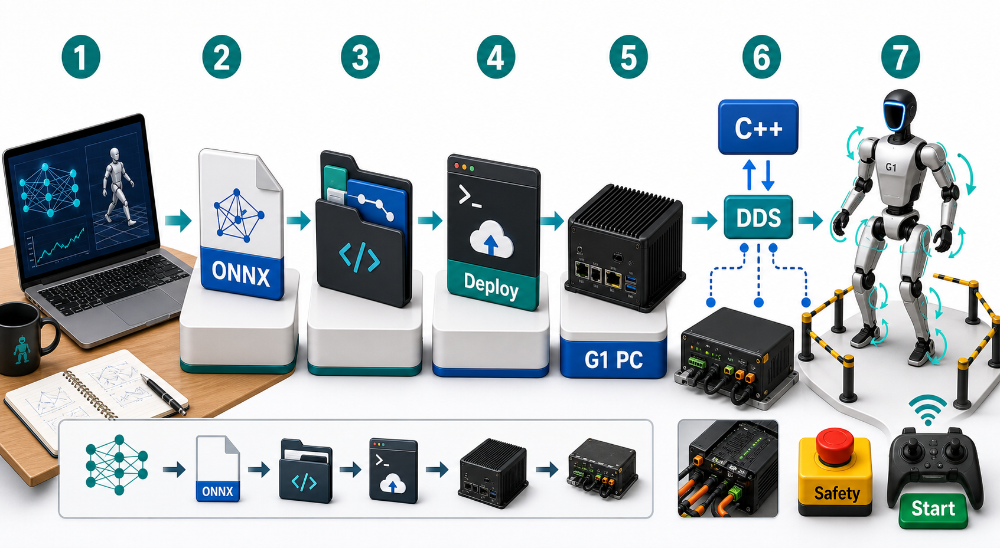

# 从训练好的策略到 Unitree G1 真机部署：完整心智模型

这篇教程只回答一个问题：

> 我已经有一个训练好的 `.onnx` 策略，怎么一步一步让它真正跑到 Unitree G1 上？

先看总图。你可以把整个系统理解成一条流水线：训练产物进入 Python 运行时，Python 每一帧算出关节目标，C++ 后端负责稳定地通过 DDS 发给机器人底层。



## 1. 先分清三层

你现在最容易混乱的点是：一会儿看到 shell 脚本，一会儿看到 `unitree_cpp`，一会儿又看到 `main.py`。它们不是互相替代的东西，而是处在不同层。

| 层级 | 负责什么 | 项目里的代表 |
| --- | --- | --- |
| 脚本层 | 搬运代码、安装依赖、编译底层库、做部署前检查 | `scripts/deploy_to_robot.sh`, `scripts/build_cpp_backend.sh` |
| Python 运行时层 | 解析命令、加载配置、加载 ONNX 策略、组织控制循环、安全检查、日志 | `src/unitree_launcher/main.py`, `Runtime`, `SafetyController`, `Policy` |
| 真机适配层 | 把项目统一的 `RobotCommand` 变成 Unitree 真机能收的底层命令 | `src/unitree_launcher/robot/real_robot.py` |
| C++/DDS/硬件层 | DDS 通信、CRC、底层 motor mode、持续重发上一帧命令 | `unitree_cpp.UnitreeController`, `rt/lowstate`, `rt/lowcmd`, G1 motor control board |

一句话：

> shell 脚本负责“把东西装好、传过去”；`main.py` 负责“启动控制程序”；`RealRobot` 负责“连接真机”；`unitree_cpp` 负责“和 Unitree 底层稳定通信”。

## 2. 项目不负责训练，只负责部署和运行策略

这个仓库的起点不是训练，而是一个已经导出的 ONNX 策略：

```text
训练框架 / RL / imitation learning
        |
        v
assets/policies/xxx.onnx
        |
        v
unitree_launcher 加载并部署
```

策略文件通常放在：

```bash
assets/policies/<your_policy>.onnx
```

例如：

```bash
assets/policies/stance_29dof.onnx
assets/policies/beyondmimic_29dof.onnx
```

注意：`.onnx` 只是“神经网络推理文件”。它自己不会控制机器人。它必须被 Python 运行时加载，然后每一帧输入机器人状态，输出动作。

## 3. 一条真机命令到底发生了什么

假设你在 G1 机载电脑上运行：

```bash
uv run real --policy assets/policies/beyondmimic_29dof.onnx
```

这条命令的真实流动是：

```text
uv run real
  -> pyproject.toml 的 real 脚本
  -> unitree_launcher.main:cli_real()
  -> main(["real", ...])
  -> argparse 解析成 args
  -> load_config("configs/real.yaml")
  -> apply_cli_overrides(config, args)
  -> 创建 RealRobot(config)
  -> load_policy(args.policy, ...)
  -> 创建 SafetyController
  -> 创建 Runtime
  -> robot.connect()
  -> RealRobot 内部创建 unitree_cpp.UnitreeController
  -> PREPARE 5 秒
  -> 等待手柄 Start，除非用了 --auto
  -> Runtime 开始循环控制
```

对应代码位置：

| 你想看什么 | 代码位置 |
| --- | --- |
| `uv run real` 入口 | `pyproject.toml` 的 `[project.scripts]`，`real = "unitree_launcher.main:cli_real"` |
| CLI 参数和 `real` 子命令 | `src/unitree_launcher/main.py` 的 `build_parser()` |
| `real` 模式创建真机对象 | `src/unitree_launcher/main.py` 中 `RealRobot(config)` |
| 真机连接 | `src/unitree_launcher/robot/real_robot.py` 的 `connect()` |
| 真机读状态 | `RealRobot.get_state()` |
| 真机发命令 | `RealRobot.send_command()` |
| 默认真机配置 | `configs/real.yaml` |

## 4. Runtime 每一帧在干什么

真机跑起来后，不是 shell 脚本在循环控制机器人，而是 `Runtime` 在循环。

可以把每一帧理解成：

```text
1. RealRobot.get_state()
   从 unitree_cpp 读取最新 LowState
   得到关节角、关节速度、力矩估计、IMU、手柄字节

2. Policy 推理
   把 RobotState 变成观测 obs
   ONNX policy 输出动作 action
   action 映射成目标关节位置

3. SafetyController 检查
   检查关节位置、速度、力矩、倾倒、掉帧等
   必要时进入 E-stop / damping / stop

4. RealRobot.send_command(cmd)
   调用 unitree_cpp:
     set_gains(kp, kd)
     step(target_joint_positions)

5. unitree_cpp 通过 DDS 发到底层
   发送 rt/lowcmd
   同时持续接收 rt/lowstate
```

更短的心智模型：

```text
机器人状态 -> 策略推理 -> 安全过滤 -> 关节命令 -> DDS -> 电机
```

## 5. `unitree_cpp` 到底是什么

`unitree_cpp` 不是这个项目的 Python 文件，它是一个 C++ 写的 Python 扩展模块。

它在这里被导入：

```python
from unitree_cpp import UnitreeController
```

位置在：

```text
src/unitree_launcher/robot/real_robot.py
```

`RealRobot.connect()` 会构造一个 `config_dict`，里面包括：

```python
{
    "net_if": "eth0",
    "control_dt": 0.02,
    "msg_type": "hg",
    "control_mode": "position",
    "lowcmd_topic": "rt/lowcmd",
    "lowstate_topic": "rt/lowstate",
    "num_dofs": 29,
}
```

然后创建：

```python
self._controller = UnitreeController(config_dict)
```

这一步才是真正打开 Unitree DDS 通信链路。

`unitree_cpp` 做的事情包括：

- 初始化 DDS 通道。
- 订阅 `rt/lowstate`，拿机器人状态。
- 发布 `rt/lowcmd`，发底层命令。
- 处理 CRC。
- 处理 motor mode / mode_machine。
- 在 C++ 线程里按 `control_dt = 0.02` 秒持续重发上一帧命令。

最后一条很重要：如果 Python 某一帧有轻微抖动，C++ 后端仍会继续重发上一帧命令，避免底层长时间收不到命令。

但这也带来一个安全事实：

> 如果 Python 整个卡死，软件 E-stop 也可能失效，因为 C++ 还在重发上一帧命令。硬件兜底是手柄 `L2+B`，这是 motor control board 级别的 damping。

## 6. Shell 脚本不是控制器

你之前混乱的核心就是把“部署脚本”和“控制器”混在一起了。

| 名字 | 它是什么 | 它不是什么 |
| --- | --- | --- |
| `scripts/deploy_to_robot.sh` | 把当前仓库同步到 G1 电脑，并做 `uv`、`unitree_cpp` 预检查 | 不是控制循环 |
| `scripts/build_cpp_backend.sh` | 在 G1 上编译安装 `unitree_sdk2` 和 `unitree_cpp` | 不是策略运行入口 |
| `unitree_cpp` | Python 可以 import 的 C++ 后端模块 | 不是 shell 脚本 |
| `UnitreeController` | `unitree_cpp` 里真正和 DDS 通信的控制对象 | 不是项目主流程 |
| `RealRobot` | 本项目对真机的适配器，符合 `RobotInterface` | 不是训练框架 |
| `Runtime` | 本项目的主控制循环组织者 | 不是 Unitree SDK |
| `rt/lowstate` | 机器人发给软件的状态 topic | 不是控制命令 |
| `rt/lowcmd` | 软件发给机器人的命令 topic | 不是状态反馈 |

所以完整关系是：

```text
deploy_to_robot.sh
  只负责把代码同步到 G1 电脑

build_cpp_backend.sh
  只负责把 C++ 后端装好，让 Python 能 import unitree_cpp

uv run real --policy xxx.onnx
  才是真正启动真机控制程序
```

## 7. 真机部署全流程

下面按真实操作顺序讲。

### Step 0：拿到训练好的策略

你需要一个 ONNX 文件：

```bash
assets/policies/<your_policy>.onnx
```

先确认它的自由度和机器人配置匹配。例如 G1 29DoF 策略应该对应：

```yaml
robot:
  variant: g1_29dof
```

真机默认配置在：

```bash
configs/real.yaml
```

里面默认是：

```yaml
policy:
  default_policy: "assets/policies/stance_29dof.onnx"

control:
  policy_frequency: 50

network:
  interface: "eth0"
  domain_id: 0
```

### Step 1：先在仿真里跑通

不要直接上真机。

先同步依赖：

```bash
uv sync --extra dev --extra sim
```

用 GUI 或 viser 看行为：

```bash
uv run sim --gui --policy assets/policies/<your_policy>.onnx
```

或者：

```bash
uv run sim --viser --policy assets/policies/<your_policy>.onnx
```

再做 headless eval：

```bash
uv run eval --steps 500 --policy assets/policies/<your_policy>.onnx
```

这一步你要确认：

- 策略能加载。
- 关节维度正确。
- 机器人不会立刻倒。
- 动作没有明显爆炸。
- 起始姿态和训练时一致。

### Step 2：准备网络

README 里记录的默认网络心智模型是：

| 设备 | IP |
| --- | --- |
| G1 motor control board | `192.168.123.161` |
| G1 机载电脑，也就是 SSH 进去的电脑 | `192.168.123.164` |
| 你的开发机 | `192.168.123.100` |

你从开发机 SSH 到 G1 电脑：

```bash
ssh unitree@192.168.123.164
```

而 G1 电脑再通过 `eth0` 和 motor control board 通信。真机程序默认接口也是：

```bash
eth0
```

这对应 `configs/real.yaml`：

```yaml
network:
  interface: "eth0"
  domain_id: 0
```

### Step 3：把代码和策略同步到机器人

在开发机项目根目录运行：

```bash
./scripts/deploy_to_robot.sh
```

这个脚本默认同步到：

```text
unitree@192.168.123.164:/home/unitree/unitree_launcher
```

它还会在机器人上做预检查：

- 有没有 `uv`。
- `uv sync` 能不能跑。
- Python 能不能 import `unitree_cpp`。

如果它提示：

```text
WARN: unitree_cpp not installed
```

说明 C++ 后端还没装好。继续下一步。

### Step 4：在机器人上编译 C++ 后端

SSH 到机器人：

```bash
ssh unitree@192.168.123.164
cd ~/unitree_launcher
```

第一次需要运行：

```bash
./scripts/build_cpp_backend.sh
```

这个脚本做两件事：

```text
1. 编译安装 unitree_sdk2 到 /usr/local
2. 编译安装 HansZ8/unitree_cpp，让 Python 能 import UnitreeController
```

成功后它会验证：

```bash
uv run python -c "from unitree_cpp import UnitreeController; print('unitree_cpp OK')"
```

这里要记住：

> `build_cpp_backend.sh` 只是把后端装好。它不会启动控制，也不会让机器人动。

### Step 5：先做只读 DDS 检查

正式控制前，先确认机器人状态能读到。

在 G1 电脑上：

```bash
cd ~/unitree_launcher
uv run python scripts/tests/test_dds.py --interface eth0 --duration 5
```

这个脚本只订阅：

```text
rt/lowstate
```

也就是只读机器人状态，不发控制命令。

如果能看到关节角、`mode_machine`、消息频率，说明 DDS 状态链路基本通了。

如果没有消息，先别控制。检查：

- 线有没有接。
- 机器人有没有开机并启动完成。
- `eth0` 是不是正确接口。
- `ping 192.168.123.161` 是否通。
- DDS domain 是否是 `0`。

### Step 6：先跑 gantry 或安全测试

推荐先让机器人在保护架或吊挂状态下跑：

```bash
uv run real --gantry --duration 40
```

`--gantry` 是测试模式，不需要策略文件。它会进入准备姿态，然后对一个关节做小幅正弦测试，用来验证：

- 真机链路能发命令。
- 电机响应正常。
- `RealRobot -> unitree_cpp -> DDS -> motor board` 这条链路没断。

### Step 7：跑真实策略

确认前面都通过后，再运行：

```bash
uv run real --policy assets/policies/<your_policy>.onnx
```

默认情况下，真机模式会：

```text
1. 连接 RealRobot
2. 创建 UnitreeController
3. 进入 PREPARE 5 秒，平滑过渡到默认姿态
4. 等待手柄 Start
5. 开始执行 policy
```

如果你加：

```bash
--auto
```

就会跳过手动 Start，准备阶段后自动开始策略。初次真机测试不建议这么做。

如果要指定网卡：

```bash
uv run real --interface eth0 --policy assets/policies/<your_policy>.onnx
```

## 8. 真机安全链路

真机部署不是“能跑就行”，你要把安全链路作为主流程的一部分理解。

`configs/real.yaml` 默认打开：

```yaml
safety:
  joint_position_limits: true
  joint_velocity_limits: true
  torque_limits: true
  tilt_check: true
  frame_drop_check: true
```

手柄默认含义：

| 手柄输入 | 含义 |
| --- | --- |
| `Start` | 启动策略 |
| `Select` | 停止策略 |
| `A` | 软件 E-stop |
| `B` | motion fade out |
| `X` | motion fade in |
| `Y` | motion reset |
| `R1+DUp` | 下一条策略 |
| `R1+DDn` | 上一条策略 |
| `L2+B` | 硬件 damping 兜底 |

重点：

```text
A 是软件 E-stop：依赖 Python 还在跑。
L2+B 是硬件级 damping：不依赖 Python。
```

第一次上真机时，必须先确认操作员知道 `L2+B`。

## 9. 你应该怎么读代码

不要从 `main.py` 第一行读到最后一行。按控制链路读。

### 入口：命令怎么进来

读：

```text
pyproject.toml
src/unitree_launcher/main.py: cli_real()
src/unitree_launcher/main.py: build_parser()
```

你要理解：

```text
uv run real --policy xxx.onnx
```

会变成：

```python
main(["real", "--policy", "xxx.onnx"])
```

然后 argparse 把它变成：

```python
args.mode == "real"
args.policy == "xxx.onnx"
args.config == "configs/real.yaml"
args.interface == "eth0"
```

### 配置：真机默认行为从哪里来

读：

```text
configs/real.yaml
```

重点看：

- `robot.variant`
- `policy.default_policy`
- `control.policy_frequency`
- `safety`
- `network.interface`
- `network.domain_id`

### 创建真机对象

读：

```text
src/unitree_launcher/main.py
```

找这段逻辑：

```python
if args.mode in ("sim", "eval"):
    robot = SimRobot(config)
else:
    robot = RealRobot(config)
```

这说明：

```text
sim/eval -> SimRobot
real     -> RealRobot
```

### 连接真机

读：

```text
src/unitree_launcher/robot/real_robot.py
```

重点是：

```python
def connect(self):
    from unitree_cpp import UnitreeController
    self._controller = UnitreeController(config_dict)
```

如果这里 import 失败，就说明 `build_cpp_backend.sh` 没成功，或者当前 Python 环境里没有 `unitree_cpp`。

### 读状态

读：

```python
def get_state(self) -> RobotState:
```

它从 C++ 后端拿：

- `motor_state.q`
- `motor_state.dq`
- `motor_state.tau_est`
- `imu_state.quaternion`
- `imu_state.gyroscope`
- `imu_state.accelerometer`
- `wireless_remote`

然后包装成项目统一的：

```python
RobotState
```

### 发命令

读：

```python
def send_command(self, cmd: RobotCommand) -> None:
    self._controller.set_gains(cmd.kp.tolist(), cmd.kd.tolist())
    self._controller.step(cmd.joint_positions.tolist())
```

这就是 Python 层真正把策略输出发给真机的地方。

## 10. 部署前检查清单

上真机前逐项确认：

- 策略已经在仿真里跑过。
- 策略 DoF 和 `robot.variant` 匹配。
- 策略的关节顺序和项目 `JointMapper` 兼容。
- `assets/policies/<your_policy>.onnx` 已同步到机器人。
- G1 电脑能 `import unitree_cpp`。
- `test_dds.py` 能收到 `rt/lowstate`。
- 操作员知道 `A` 和 `L2+B`。
- 第一次测试在 gantry / 吊挂 / 保护条件下。
- 不使用 `--auto`，先手动 Start。
- 日志目录空间足够。

## 11. 什么时候必须停下来

遇到下面情况不要继续真机控制：

- `unitree_cpp is not installed`。
- `test_dds.py` 收不到任何 `rt/lowstate`。
- 机器人不在保护架上，而策略还没在仿真验证。
- 不确定策略关节顺序。
- 不确定策略输出是关节位置、残差动作还是别的动作格式。
- 不知道硬件 `L2+B` 怎么触发。
- 机器人启动后姿态明显不对。
- `mode_machine` 或电机状态异常。

## 12. 最后用一句话串起来

完整链路是：

```text
训练导出 ONNX
  -> 放进 assets/policies
  -> 仿真验证
  -> deploy_to_robot.sh 同步到 G1 电脑
  -> build_cpp_backend.sh 安装 unitree_cpp
  -> test_dds.py 只读确认状态链路
  -> uv run real --gantry 验证控制链路
  -> uv run real --policy xxx.onnx
  -> main.py 创建 Runtime + RealRobot
  -> RealRobot.connect() 创建 UnitreeController
  -> Runtime 每帧 state -> policy -> safety -> command
  -> RealRobot.send_command()
  -> unitree_cpp 发布 rt/lowcmd
  -> G1 motor control board 执行动作
```

你之后读这个项目时，不要再把所有东西混成一团。始终问自己当前看到的代码处在哪一层：

```text
它是在准备环境？
它是在解析命令？
它是在加载策略？
它是在跑控制循环？
它是在适配真机？
它是在和 DDS/电机通信？
```

能回答这个问题，整个项目的心智模型就立住了。
