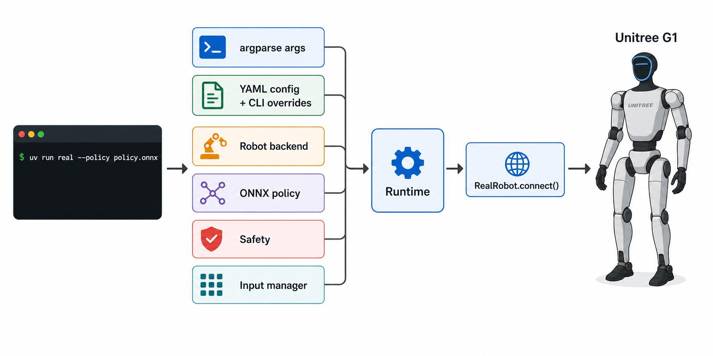
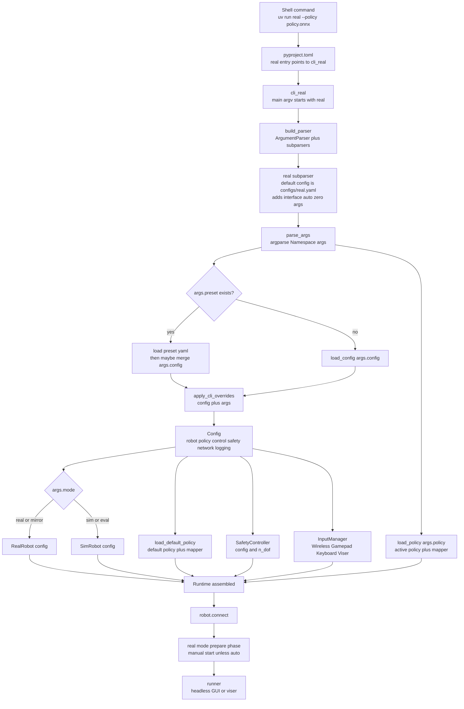

# Lesson 01: 从 CLI 命令到 Runtime 装配

本节回答一个具体问题：

```text
我输入 uv run real --policy xxx.onnx 后，main.py 到底把数据传到哪里去了？
```

先给结论：

```text
main.py 不是每帧控制机器人的地方。
main.py 的主要职责是把 CLI 参数和 YAML 配置装配成一套 Runtime。
装配完成后，才调用 robot.connect()，进入真机连接和后续控制循环。
```

本节只讲启动装配链路，不展开 `RealRobot.connect()` 内部的 SDK/DDS 连接，也不展开 `Runtime.step()` 每个控制 tick 里怎么读状态、跑 policy、发命令。

## 0. 先看直觉图



这张图是为了建立心智模型。精确事实以后面的 Mermaid 图和代码证据为准。

## 1. 本节边界

本节讲这条链：

```text
Shell command
  -> pyproject entry
  -> cli_real()
  -> main(argv)
  -> argparse Namespace args
  -> YAML config + CLI overrides
  -> RealRobot / Policy / Safety / Input
  -> Runtime
  -> robot.connect()
```

本节暂时不讲：

- `RealRobot.connect()` 如何接到 `unitree_cpp`、Unitree SDK2、DDS topic。
- `Runtime.step()` 如何一帧一帧控制机器人。
- `Policy.step()` 如何构造 observation、运行 ONNX、生成 action。

你可以把本节当成“启动时的装配课”。下一节再讲真机连接。

## 2. 一句话心智模型

如果用类比：

| 项目概念 | 类比 |
| --- | --- |
| `args` | 终端输入解析出来的订单 |
| `config` | YAML 默认值和 CLI 覆盖项合成后的施工图 |
| `RealRobot(config)` | 真机后端对象，还没有真正连上机器人 |
| `Policy` | 训练好并导出的控制策略 |
| `SafetyController` | 安全闸门 |
| `InputManager` | 手柄、键盘、无线手柄等人工输入入口 |
| `Runtime` | 把 robot、policy、safety、input 组装在一起的控制台 |
| `robot.connect()` | 真正开始连接机器人通信层 |

所以看到 `main.py` 里代码很多时，不要先把它当成“控制算法”。它更像一个启动编排器：

```text
读参数 -> 读配置 -> 创建对象 -> 组装 Runtime -> 连接 robot -> 选择 runner 运行
```

## 3. 精确数据流



这张图里最重要的分界线是：

```text
args 是命令行解析结果。
config 是项目运行配置。
Runtime 是已经装配好的运行时对象。
robot.connect() 才开始连接具体 robot backend。
```

## 4. 从终端命令到 Python 入口

你输入：

```bash
uv run real --policy assets/policies/beyondmimic_29dof.onnx
```

这不是直接调用某个 `real.py` 文件，而是走 `pyproject.toml` 里的脚本入口：

```toml
[project.scripts]
real = "unitree_launcher.main:cli_real"
```

所以：

```text
uv run real
  -> unitree_launcher.main:cli_real()
```

`cli_real()` 里做了一件很关键的事：

```python
main(["real"] + sys.argv[1:])
```

也就是说，终端里的：

```bash
uv run real --policy assets/policies/beyondmimic_29dof.onnx
```

进入 `main()` 后，大致变成：

```python
main([
    "real",
    "--policy",
    "assets/policies/beyondmimic_29dof.onnx",
])
```

这里的 `"real"` 很重要。它告诉 `argparse`：这次走 `real` 这个子命令。

## 5. parser、subparser、args 到底是什么

### parser 是整套命令行语法

`build_parser()` 里创建的是总 parser：

```python
parser = argparse.ArgumentParser(...)
```

你可以把 `parser` 理解成：

```text
这个程序允许用户在终端里怎么写命令。
```

### subparser 是 mode 分支

这个项目支持多个启动模式：

```text
sim
eval
real
mirror
replay
```

所以 `main.py` 用：

```python
subparsers = parser.add_subparsers(dest="mode", required=True)
```

意思是：

```text
用户必须选择一个 mode。
选了 real，就按 real 的参数规则解析。
选了 sim，就按 sim 的参数规则解析。
```

`real` 子命令会设置真机模式自己的默认值和参数，例如：

```python
real_parser = subparsers.add_parser("real", ...)
_add_base_args(real_parser, "configs/real.yaml")
real_parser.add_argument("--interface", default="eth0")
real_parser.add_argument("--auto", action="store_true")
real_parser.add_argument("--zero", action="store_true")
```

这解释了为什么你没有写 `--config configs/real.yaml`，项目仍然会使用 `configs/real.yaml`：因为 `real` subparser 给了默认值。

### args 是解析后的结构化对象

`parse_args()` 会把字符串列表变成一个 `argparse.Namespace`。

对于：

```bash
uv run real --policy assets/policies/beyondmimic_29dof.onnx
```

核心结果可以理解成：

```python
args.mode == "real"
args.policy == "assets/policies/beyondmimic_29dof.onnx"
args.config == "configs/real.yaml"
args.preset == None
args.interface == "eth0"
args.auto == False
args.zero == False
```

注意：`args` 不是项目配置本身。`args` 只是“终端字符串解析结果”。

## 6. `args.preset` 是什么

`args.preset` 来自基础参数里的：

```python
parser.add_argument("--preset", ...)
```

它的作用是选择一个预设配置文件：

```text
--preset xxx
  -> 优先加载 configs/xxx.yaml
```

在 `main.py` 里，配置加载逻辑是：

```text
if args.preset:
    先加载 configs/{args.preset}.yaml
    如果用户还显式传了 --config，则再 merge 这个 config
else:
    加载 args.config

最后统一 apply_cli_overrides(config, args)
```

所以 `args.preset` 控制的是“基础配置从哪里来”。

举例：

```bash
uv run real --policy a.onnx
```

大致是：

```text
args.preset == None
-> load_config("configs/real.yaml")
-> apply_cli_overrides(...)
```

而：

```bash
uv run real --preset lab_g1 --policy a.onnx
```

大致是：

```text
args.preset == "lab_g1"
-> load_config("configs/lab_g1.yaml")
-> apply_cli_overrides(...)
```

如果再加：

```bash
uv run real --preset lab_g1 --config configs/custom.yaml --policy a.onnx
```

则是：

```text
先加载 preset
再合并 custom config
最后 CLI 参数覆盖 config
```

这就是 `args.preset` 的数据流。它不是机器人模式，也不是策略文件，它只是配置选择器。

## 7. `args -> config`

`real` 模式默认配置来自 `configs/real.yaml`。里面包含真机运行需要的默认值，例如：

```yaml
robot:
  variant: "g1_29dof"

policy:
  default_policy: "assets/policies/stance_29dof.onnx"

control:
  policy_frequency: 50
  sim_frequency: 1000
  kd_damp: 8.0

safety:
  enabled: true

network:
  interface: "eth0"
  domain_id: 0
```

`main.py` 里会先加载 YAML，再让 CLI 覆盖一部分字段：

```text
YAML 默认值
  + preset/custom config
  + CLI overrides
  = 最终 config
```

所以这两个命令的差异是：

```bash
uv run real --policy a.onnx
uv run real --policy a.onnx --interface enp3s0
```

第一条使用 `configs/real.yaml` 里的默认 `eth0`。

第二条会通过 CLI override 把网络接口改成 `enp3s0`。

记住这个原则：

```text
args 负责表达用户这次怎么启动。
config 负责表达项目最终按什么参数运行。
```

## 8. `config -> robot/policy/safety/input`

有了 `config` 后，`main.py` 开始创建运行时需要的对象。

### robot backend

对于 `real`：

```python
robot = RealRobot(config)
```

这里只是创建 `RealRobot` 对象，还没有真正和机器人通信。真正连接发生在后面的：

```python
robot.connect()
```

### default policy

项目还会加载一个默认策略：

```text
default_policy = configs/real.yaml 里的 policy.default_policy
```

默认策略通常用于安全过渡、准备阶段或 fallback。它不是你通过 `--policy` 指定的 active policy。

### active policy

你通过命令行传的：

```bash
--policy assets/policies/beyondmimic_29dof.onnx
```

会被加载成 active policy：

```text
active_policy + active_joint_mapper
```

active policy 才是后续正常运行时主要执行的策略。

### safety

`SafetyController` 根据 config 和自由度数量创建：

```python
safety = SafetyController(config, n_dof=robot.n_dof)
```

它的作用不是训练策略，而是在 runtime 运行时检查系统状态、E-stop、姿态、掉帧、命令范围等安全条件。

### input

`InputManager` 会收集控制输入。真机模式下通常会包含：

```text
WirelessController
GamepadController
KeyboardController
ViserController
```

这些输入后续会影响 Runtime 的模式切换、速度命令、start/stop 等行为。

## 9. `Runtime(...)` 是装配结果

当 robot、policy、safety、input 都准备好后，`main.py` 创建 `Runtime`：

```python
runtime = Runtime(
    robot=robot,
    policy=active_policy,
    safety=safety,
    joint_mapper=active_joint_mapper,
    config=config,
    input_manager=input_mgr,
    default_policy=default_policy,
    default_joint_mapper=default_joint_mapper,
)
```

这一步之后，项目才真正拥有一套完整控制台：

```text
robot: 去哪里读状态、发命令
policy: 怎么从状态算命令
safety: 命令能不能发、是否要拦截
input: 人怎么控制启动、停止、速度
config: 频率、网络、安全、日志等参数
```

但是即使 `Runtime` 创建好了，也还不等于机器人已经连接。

## 10. `robot.connect()` 和为什么会站着不动

`Runtime` 装配完成后，`main.py` 才调用：

```python
robot.connect()
```

对真机来说，这一步后面才会进入 `RealRobot.connect()`，再通过 `unitree_cpp` 接到底层 Unitree SDK2 / DDS 通信。

在 `real` 模式里，`robot.connect()` 后还有两个容易让人误解的点：

1. 真机启动后会进入 prepare phase，代码里给 real mode 设置了大约 5 秒准备阶段。
2. 默认情况下 `runtime.require_manual_start = True`，也就是需要人工 start。除非你传了 `--auto`。

所以“打开后机器人站着不动”不一定是坏事。它可能只是：

```text
程序已经启动并装配完成
机器人已连接或正在准备
但 active policy 还没有被人工 start 激活
```

当然，真机上不能只凭这个判断安全状态。需要结合日志、手柄状态、DDS 状态、E-stop、安全状态一起看。

## 11. 代码证据地图

| 代码位置 | 证据 | 含义 |
| --- | --- | --- |
| `pyproject.toml:14` | `[project.scripts]` | 项目把终端命令注册成 Python 入口 |
| `pyproject.toml:17` | `real = "unitree_launcher.main:cli_real"` | `uv run real` 会进入 `cli_real()` |
| `src/unitree_launcher/main.py:995` | `def cli_real()` | 真机 CLI 入口函数 |
| `src/unitree_launcher/main.py:1004` | `main(["real"] + sys.argv[1:])` | 把 `real` mode 塞进 argv |
| `src/unitree_launcher/main.py:322` | `_add_base_args(...)` | 定义 `--config`、`--preset`、`--policy` 等基础参数 |
| `src/unitree_launcher/main.py:365` | `build_parser()` | 创建总 CLI parser |
| `src/unitree_launcher/main.py:370` | `add_subparsers(dest="mode", required=True)` | mode 来自 subparser |
| `src/unitree_launcher/main.py:406` | `real_parser = subparsers.add_parser("real", ...)` | 定义 real 子命令 |
| `src/unitree_launcher/main.py:407` | `_add_base_args(real_parser, "configs/real.yaml")` | real 默认 config 是 `configs/real.yaml` |
| `src/unitree_launcher/main.py:413` | `--interface`, default `eth0` | 真机网络接口默认值 |
| `src/unitree_launcher/main.py:505` | `if args.preset:` | preset 分支开始 |
| `src/unitree_launcher/main.py:506` | `configs/{args.preset}.yaml` | `--preset` 会选择预设 YAML |
| `src/unitree_launcher/main.py:515` | `apply_cli_overrides(config, args)` | CLI 参数覆盖 config |
| `src/unitree_launcher/main.py:527` | `if args.mode in ("sim", "eval")` | 根据 mode 选择 robot backend |
| `src/unitree_launcher/main.py:532` | `robot = RealRobot(config)` | real/mirror 使用真机后端 |
| `src/unitree_launcher/main.py:722` | `default_policy_path = config.policy.default_policy` | 默认策略来自 config |
| `src/unitree_launcher/main.py:727` | `load_policy(args.policy, ...)` | active policy 来自 CLI |
| `src/unitree_launcher/main.py:753` | `SafetyController(...)` | 创建安全控制器 |
| `src/unitree_launcher/main.py:780` | `input_controllers = []` | 开始组装输入控制器 |
| `src/unitree_launcher/main.py:809` | `runtime = Runtime(...)` | 装配 Runtime |
| `src/unitree_launcher/main.py:837` | `robot.connect()` | Runtime 装配后才连接 robot |
| `src/unitree_launcher/main.py:888` | `PREPARE` phase | real mode 启动准备阶段 |
| `src/unitree_launcher/main.py:895` | `require_manual_start = True` | 默认需要人工 start，除非 `--auto` |
| `configs/real.yaml:14` | `variant: "g1_29dof"` | real 默认机器人型号 |
| `configs/real.yaml:18` | `default_policy` | real 默认 fallback/准备策略 |
| `configs/real.yaml:24` | `policy_frequency: 50` | 策略控制频率 |
| `configs/real.yaml:36` | `interface: "eth0"` | 默认网络接口 |

## 12. 你现在应该记住什么

1. `parser` 是整套命令行语法。
2. `subparser` 是 `sim/eval/real/mirror/replay` 这些 mode 分支。
3. `args` 是 argparse 解析终端字符串后的 `Namespace`。
4. `args.preset` 只是配置选择器，用来决定是否加载 `configs/{preset}.yaml`。
5. `config` 是 YAML、preset/custom config、CLI overrides 合并后的运行配置。
6. `RealRobot(config)` 只是创建真机后端对象，不等于已经连接机器人。
7. `Runtime(...)` 是把 robot、policy、safety、input、config 组装起来。
8. `robot.connect()` 之后才进入真机通信层，下一节会重点讲。

## 13. 自测题

请你尝试不用看上文回答：

1. 为什么 `uv run real --policy a.onnx` 进入 Python 后会变成 `main(["real", "--policy", "a.onnx"])`？
2. `parser` 和 `subparser` 的区别是什么？
3. `args` 和 `config` 的区别是什么？
4. `args.preset` 不为空时，配置加载顺序发生了什么变化？
5. 为什么 `RealRobot(config)` 不等于已经连接真机？
6. `default_policy` 和 `--policy` 指定的 active policy 有什么区别？
7. 为什么真机程序启动后机器人可能站着不动？

如果这 7 个问题都能答出来，你就已经掌握了 `main.py` 的第一层心智模型。

## 14. 下一节

下一节建议继续顺着数据流讲：

```text
Lesson 02: RealRobot.connect() 如何接到 unitree_cpp / Unitree SDK2 / DDS
```

也就是从本节最后的：

```python
robot.connect()
```

继续往下钻。
