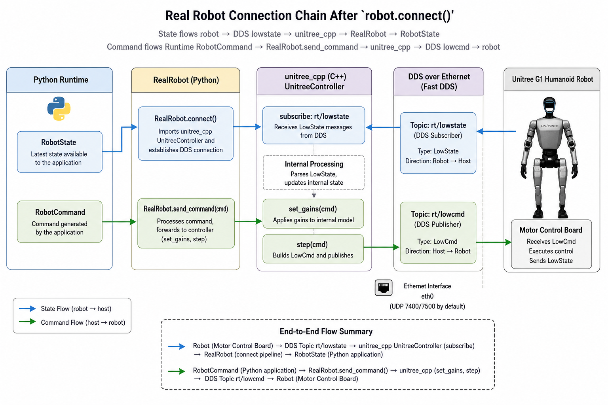
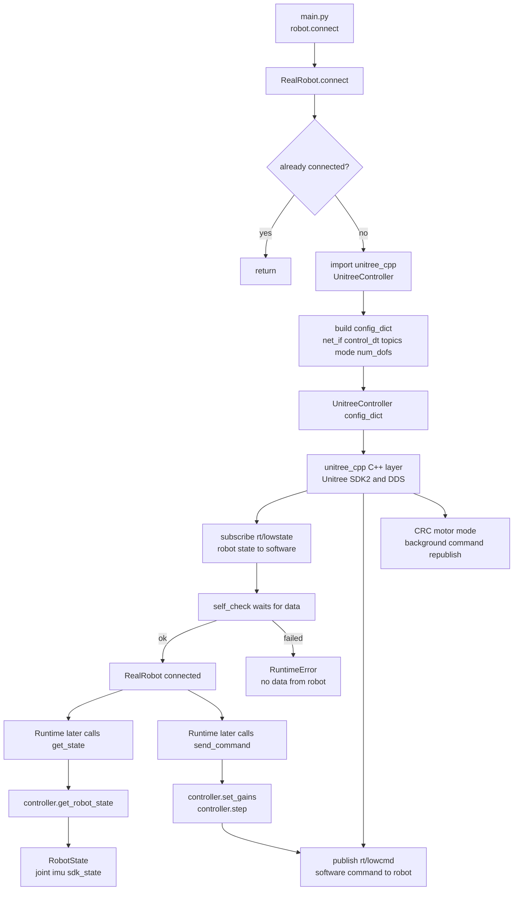

# Lesson 02: RealRobot.connect 如何接到 unitree_cpp / SDK / DDS

本节接 Lesson 01 的最后一步：

```python
robot.connect()
```

本节回答：

```text
main.py 调用 robot.connect() 后，真机控制链路到底怎么接到 G1？
```

先给结论：

```text
RealRobot.connect() 本身不直接写 DDS 代码。
它导入 unitree_cpp.UnitreeController，把网络接口、topic、控制模式、自由度数量等信息放进 config_dict。
UnitreeController 是 C++ Python binding，内部再处理 Unitree SDK2、DDS、CRC、motor mode 和底层命令重发。
```

所以这节的核心心智模型是：

```text
Python Runtime
  -> RealRobot
  -> unitree_cpp.UnitreeController
  -> Unitree SDK2 / DDS
  -> G1 motor control board
```

## 0. 先看直觉图



图片只负责帮助你建立直觉。精确事实以后面的 Mermaid 和代码证据为准。

## 1. 本节边界

本节讲：

```text
robot.connect()
  -> RealRobot.connect()
  -> import unitree_cpp.UnitreeController
  -> 构造 config_dict
  -> 创建 UnitreeController
  -> self_check 等待 rt/lowstate
  -> 后续 get_state / send_command 复用这个 controller
```

本节不讲：

- Unitree SDK2 C++ 源码内部如何实现 DDS。
- `unitree_cpp` 仓库内部线程和 CRC 的每一行实现。
- `Runtime.step()` 如何选择 policy 和安全模式。

你现在先把“Python 项目如何接上真机通信层”看清楚。

## 2. 精确数据流



这张图里有两个阶段：

1. 连接阶段：`connect()` 创建 `UnitreeController`，并用 `self_check()` 确认能收到状态。
2. 运行阶段：`get_state()` 从 controller 读状态，`send_command()` 通过 controller 发命令。

## 3. 先区分三个东西

这三个名字经常混在一起：

| 名字 | 它是什么 | 在本项目里谁用它 |
| --- | --- | --- |
| `RealRobot` | 本项目的 Python 真机后端 | `main.py` / `Runtime` |
| `unitree_cpp` | C++ 写的 Python 扩展模块 | `RealRobot` import 它 |
| Unitree SDK2 / DDS | Unitree 底层通信库和通信机制 | `unitree_cpp` 内部使用 |

换句话说：

```text
Runtime 不直接认识 SDK。
Runtime 只认识 RobotInterface。
RealRobot 实现 RobotInterface。
RealRobot 再把工作委托给 unitree_cpp。
unitree_cpp 再接到底层 Unitree SDK2 / DDS。
```

这就是为什么你前面问“是不是必须有 unitree cpp”时，准确答案是：

```text
如果你使用当前 G1 真机后端，就必须能 import unitree_cpp。
如果你换机器人，可以不叫 unitree_cpp，但必须有一个等价的 SDK bridge，并让新的 Robot backend 实现 RobotInterface。
```

## 4. `RealRobot.__init__` 做了什么

Lesson 01 里已经看到：

```python
robot = RealRobot(config)
```

这一步还没有连接机器人。`RealRobot.__init__` 主要保存两类信息：

```text
robot.variant -> 决定 n_dof
config.network.interface -> 决定使用哪个网口
```

代码里的关键字段是：

```python
self._n_dof = len(_get_joints_for_variant(variant))
self._iface_name = config.network.interface
self._connected = False
self._controller = None
```

所以 `RealRobot(config)` 的产物只是一个 Python 后端对象：

```text
知道自己是 29DOF 还是 23DOF
知道自己准备用哪个网口
还没有 UnitreeController
还没有 DDS 连接
```

## 5. `RealRobot.connect()` 第一步：导入 unitree_cpp

`connect()` 先检查：

```python
if self._connected:
    return
```

这让重复调用 `connect()` 不会重复创建 controller。测试里也覆盖了这个行为。

然后它导入：

```python
from unitree_cpp import UnitreeController
```

如果导入失败，项目会给出明确错误：

```text
unitree_cpp is not installed.
On the G1 robot, build from source:
  ./scripts/build_cpp_backend.sh
```

这说明：

```text
unitree_cpp 不是本仓库里的普通 Python 文件。
它是需要在机器人电脑上编译安装的 Python 扩展模块。
```

## 6. `config_dict` 是 Python 到 C++ 后端的连接订单

导入成功后，`RealRobot.connect()` 会构造一个字典：

```python
config_dict = {
    "net_if": self._iface_name,
    "control_dt": 0.02,
    "msg_type": "hg",
    "control_mode": "position",
    "hand_type": "NONE",
    "lowcmd_topic": "rt/lowcmd",
    "lowstate_topic": "rt/lowstate",
    "enable_odometry": False,
    "sport_state_topic": "rt/odommodestate",
    "stiffness": [0.0] * self._n_dof,
    "damping": [0.0] * self._n_dof,
    "num_dofs": self._n_dof,
}
```

你可以把它理解成给 C++ 后端的“连接订单”：

| 字段 | 含义 |
| --- | --- |
| `net_if` | 用哪个网卡，例如 `eth0` |
| `control_dt` | C++ 后端控制周期，代码中是 `0.02` 秒 |
| `msg_type` | 使用 G1 humanoid 相关消息类型，代码中是 `hg` |
| `control_mode` | 控制模式，代码中是 `position` |
| `lowcmd_topic` | 软件发给机器人的 DDS topic：`rt/lowcmd` |
| `lowstate_topic` | 机器人发给软件的 DDS topic：`rt/lowstate` |
| `num_dofs` | 当前机器人自由度数量，例如 G1 29DOF |

这里最关键的是 topic 方向：

```text
rt/lowstate: robot -> software
rt/lowcmd:   software -> robot
```

## 7. 真正打开通信的是 UnitreeController

有了 `config_dict` 后，代码创建：

```python
self._controller = UnitreeController(config_dict)
```

这一步之后，`RealRobot` 手里有了一个 C++ controller 对象。

按照本项目 `real_robot.py` 顶部注释和类注释，这个 C++ 层负责：

```text
DDS communication
CRC computation
motor mode / mode_machine echo
MotionSwitcher service release
background command re-publishing
```

这里要注意事实和推断：

- 事实：本项目代码把这些职责写在 `real_robot.py` 注释里，并通过 `UnitreeController(config_dict)` 创建 C++ 对象。
- 推断：具体 DDS 初始化和 CRC 的实现细节在外部 `unitree_cpp` 仓库，不在当前仓库里。

## 8. `self_check()` 是连接成功的闸门

创建 controller 后，`connect()` 不会立刻宣布成功。它会等待状态数据：

```python
for _ in range(30):
    time.sleep(0.1)
    if self._controller.self_check():
        break
```

也就是最多等大约 3 秒。

如果仍然没有通过：

```python
raise RuntimeError(
    "unitree_cpp self-check failed: no data from robot. "
    "Check Ethernet cable and robot power."
)
```

这说明连接成功的最低判断不是“Python import 成功”，而是：

```text
unitree_cpp 能收到机器人状态数据。
```

通常它对应 `rt/lowstate` 能不能收到。

## 9. 连接后，状态怎么回到 Runtime

连接完成后，Runtime 后续会调用：

```python
state = robot.get_state()
```

对于 `RealRobot`，这会进入：

```python
state = self._controller.get_robot_state()
```

然后 `RealRobot` 把 C++ binding 返回的状态转换成项目统一的 `RobotState`：

```text
motor_state.q       -> joint_positions
motor_state.dq      -> joint_velocities
motor_state.tau_est -> joint_torques
imu_state.quaternion -> imu_quaternion
imu_state.gyroscope  -> imu_angular_velocity
imu_state.accelerometer -> imu_linear_acceleration
raw SDK extras -> SdkState
```

这一步很重要：

```text
Runtime 不需要知道 Unitree LowState_ 长什么样。
Runtime 只需要统一的 RobotState。
```

所以 `RealRobot` 是一个适配器。它把 Unitree/SDK 风格的数据，适配成项目内部统一的数据结构。

## 10. 连接后，命令怎么发到机器人

Runtime 后续会算出一个 `RobotCommand`，再调用：

```python
robot.send_command(cmd)
```

对于 `RealRobot`：

```python
self._controller.set_gains(cmd.kp.tolist(), cmd.kd.tolist())
self._controller.step(cmd.joint_positions.tolist())
```

也就是：

```text
RobotCommand.kp/kd
  -> UnitreeController.set_gains

RobotCommand.joint_positions
  -> UnitreeController.step
  -> C++/DDS
  -> rt/lowcmd
  -> G1 motor control board
```

注意这里暂时没有把 `joint_velocities` 和 `joint_torques` 直接传给 `unitree_cpp`。当前代码实际发送的是：

```text
position targets + kp/kd gains
```

这就是 `control_mode = "position"` 和 `send_command()` 实现对应起来的地方。

## 11. 为什么 RealRobot.step 是 no-op

在仿真里，`robot.step()` 通常要推进 MuJoCo 物理。

但真机不是这样。`RealRobot.step()` 是：

```python
pass
```

原因写在代码注释和接口说明里：

```text
RealRobot 的底层硬件和 C++ 后端负责持续执行/重发命令。
Python 这里不需要像仿真那样推进物理世界。
```

这也解释了 `unitree_cpp` 为什么重要：它不只是“包装一下 SDK”，还承担了更实时、更底层的通信和命令维持工作。

## 12. `build_cpp_backend.sh` 和 `deploy_to_robot.sh` 在链路里的位置

这两个脚本经常让人混乱。它们不是控制循环的一部分。

| 脚本 | 作用 | 是否在每帧控制里运行 |
| --- | --- | --- |
| `scripts/deploy_to_robot.sh` | 把项目同步到 G1 电脑，并做预检查 | 否 |
| `scripts/build_cpp_backend.sh` | 编译安装 Unitree SDK2 和 `unitree_cpp` | 否 |

真实关系是：

```text
第一次部署或环境坏了:
  build_cpp_backend.sh -> 让 Python 能 import unitree_cpp

每次同步代码:
  deploy_to_robot.sh -> 把仓库传到机器人电脑，检查 uv 和 unitree_cpp

真正运行控制:
  uv run real --policy ...
    -> main.py
    -> RealRobot.connect()
    -> import unitree_cpp
```

所以：

```text
脚本负责准备环境。
main.py 负责启动程序。
RealRobot 负责适配项目 runtime 和真机。
unitree_cpp 负责接 Unitree SDK2/DDS。
```

## 13. 怎么判断 DDS 本身通不通

项目里还有一个只读 DDS 测试脚本：

```bash
python scripts/tests/test_dds.py --interface eth0 --duration 5
```

它不走 `RealRobot.connect()`，而是直接用 `unitree_sdk2py`：

```python
ChannelFactoryInitialize(args.domain_id, args.interface)
sub = ChannelSubscriber("rt/lowstate", LowState_)
```

它只订阅：

```text
rt/lowstate
```

如果它能收到消息，说明至少：

```text
网线、网卡、DDS domain、机器人状态发布链路基本是通的。
```

如果它收不到，不要急着怀疑 policy。先检查：

```text
网口名是否正确
机器人是否开机完成
IP/路由是否正确
DDS domain 是否是 0
```

## 14. 这节和换机器人有什么关系

如果以后你要把这个项目换到别的机器人，第二节是最关键的迁移点。

当前 G1 链路是：

```text
RealRobot
  -> unitree_cpp.UnitreeController
  -> Unitree SDK2 / DDS
  -> rt/lowstate / rt/lowcmd
```

换机器人时，你通常不是改 `Runtime`，而是新写一个 backend：

```text
NewRobot(RobotInterface)
  -> new_robot_sdk.Client
  -> 新机器人的状态通道/命令通道
```

必须保持项目内部契约不变：

```text
get_state() -> RobotState
send_command(RobotCommand) -> 发给新机器人 SDK
connect() -> 建立新 SDK 连接
step() -> 根据新后端需要决定是否 no-op
```

这就是 `RobotInterface` 的价值：把 Runtime 和具体机器人 SDK 隔开。

## 15. 代码证据地图

| 代码位置 | 证据 | 含义 |
| --- | --- | --- |
| `src/unitree_launcher/main.py:837` | `robot.connect()` | Runtime 装配完成后才连接 robot |
| `src/unitree_launcher/main.py:839` | `robot.set_wireless_handler(...)` | 连接后再把无线手柄解析挂到 robot 状态流 |
| `src/unitree_launcher/robot/base.py:122` | `class RobotInterface` | Runtime 面向统一 robot 接口 |
| `src/unitree_launcher/robot/base.py:133` | `robot.connect()` | 统一控制循环先连接 robot |
| `src/unitree_launcher/robot/base.py:140` | `connect()` 对 RealRobot 的说明 | RealRobot 初始化 C++ binding 并验证连接 |
| `src/unitree_launcher/robot/base.py:147` | `send_command(cmd)` 对 RealRobot 的说明 | 真机命令通过 C++ binding 发送 |
| `src/unitree_launcher/robot/base.py:150` | `step()` 对 RealRobot 的说明 | RealRobot.step 是 no-op，硬件运行自己的 PD |
| `src/unitree_launcher/robot/real_robot.py:1` | 文件注释 | RealRobot 运行在 G1 上，通过 `unitree_cpp` binding |
| `src/unitree_launcher/robot/real_robot.py:3` | wraps `unitree_cpp.UnitreeController` | `RealRobot` 的下游是 `UnitreeController` |
| `src/unitree_launcher/robot/real_robot.py:44` | `__init__(self, config)` | 从 config 初始化真机后端 |
| `src/unitree_launcher/robot/real_robot.py:47` | `_n_dof` | 根据机器人 variant 决定自由度 |
| `src/unitree_launcher/robot/real_robot.py:48` | `_iface_name = config.network.interface` | 网口来自 config |
| `src/unitree_launcher/robot/real_robot.py:63` | `def connect(self)` | 真机连接入口 |
| `src/unitree_launcher/robot/real_robot.py:69` | `from unitree_cpp import UnitreeController` | 运行时导入 C++ binding |
| `src/unitree_launcher/robot/real_robot.py:77` | `config_dict = {...}` | 传给 C++ controller 的连接配置 |
| `src/unitree_launcher/robot/real_robot.py:78` | `net_if` | 使用的网口 |
| `src/unitree_launcher/robot/real_robot.py:79` | `control_dt: 0.02` | C++ 后端控制周期 |
| `src/unitree_launcher/robot/real_robot.py:83` | `lowcmd_topic: rt/lowcmd` | 软件发命令的 DDS topic |
| `src/unitree_launcher/robot/real_robot.py:84` | `lowstate_topic: rt/lowstate` | 机器人发状态的 DDS topic |
| `src/unitree_launcher/robot/real_robot.py:91` | `UnitreeController(config_dict)` | 真正创建 C++ controller |
| `src/unitree_launcher/robot/real_robot.py:94` | 等待 `self_check()` | 等待收到机器人状态 |
| `src/unitree_launcher/robot/real_robot.py:99` | `RuntimeError` | 收不到数据时提示检查网线和电源 |
| `src/unitree_launcher/robot/real_robot.py:142` | `get_robot_state()` | 从 C++ binding 读取状态 |
| `src/unitree_launcher/robot/real_robot.py:182` | `RobotState(...)` | 把 SDK 状态转换成项目统一状态 |
| `src/unitree_launcher/robot/real_robot.py:200` | `set_gains(...)` | 发送 PD gain |
| `src/unitree_launcher/robot/real_robot.py:201` | `step(joint_positions)` | 发送目标关节位置 |
| `scripts/build_cpp_backend.sh:4` | 两步过程 | 先装 Unitree SDK2，再构建 `unitree_cpp` |
| `scripts/build_cpp_backend.sh:129` | build `unitree_cpp` | 构建 Python binding |
| `scripts/build_cpp_backend.sh:154` | import 验证 | 验证 `UnitreeController` 可导入 |
| `scripts/deploy_to_robot.sh:69` | 检查 C++ backend | 部署后检查 `unitree_cpp` |
| `scripts/tests/test_dds.py:44` | `ChannelFactoryInitialize` | 只读 DDS 测试初始化 DDS |
| `scripts/tests/test_dds.py:63` | `ChannelSubscriber("rt/lowstate", LowState_)` | 只订阅低层状态 topic |
| `tests/test_real_robot.py:92` | `test_connect` | 测试 `UnitreeController` 配置 |
| `tests/test_real_robot.py:102` | `net_if == eth0` | 测试网口传入 controller |
| `tests/test_real_robot.py:153` | `test_send_command_calls_set_gains_and_step` | 测试命令发送调用 `set_gains` 和 `step` |

## 16. 你现在应该记住什么

1. `robot.connect()` 会动态分发到 `RealRobot.connect()`。
2. `RealRobot.connect()` 的核心工作是创建 `unitree_cpp.UnitreeController`。
3. `unitree_cpp` 是 Python 可 import 的 C++ binding，不是本仓库里的普通 Python 文件。
4. `UnitreeController(config_dict)` 下面才是 Unitree SDK2 / DDS。
5. `rt/lowstate` 是机器人状态流，方向是 robot -> software。
6. `rt/lowcmd` 是软件命令流，方向是 software -> robot。
7. `get_state()` 把 Unitree 状态适配成项目统一的 `RobotState`。
8. `send_command()` 把项目统一的 `RobotCommand` 转成 `set_gains()` 和 `step(joint_positions)`。
9. `RealRobot.step()` 是 no-op，因为真机不是靠 Python 推进物理。
10. 换机器人时，优先替换 backend 和 SDK bridge，尽量保持 `RobotInterface`、`RobotState`、`RobotCommand` 契约稳定。

## 17. 自测题

请你尝试不用看上文回答：

1. `RealRobot(config)` 和 `RealRobot.connect()` 的区别是什么？
2. `unitree_cpp` 在这条链路里扮演什么角色？
3. `UnitreeController(config_dict)` 里的 `net_if` 从哪里来？
4. `rt/lowstate` 和 `rt/lowcmd` 分别是什么方向？
5. `self_check()` 失败通常意味着哪一层没通？
6. `get_state()` 为什么要返回 `RobotState`，而不是直接把 SDK 原始状态交给 Runtime？
7. `send_command()` 当前实际传给 C++ 后端的是哪些字段？
8. 为什么 `RealRobot.step()` 是 no-op？
9. 如果换成别的机器人，你最应该新写哪一层？

如果你能回答这些问题，就说明你已经理解了本项目真机连接的第一层。

## 18. 下一节

下一节建议继续顺着数据流讲：

```text
Lesson 03: Runtime.step() 一帧控制循环如何从 RobotState 变成 RobotCommand
```

也就是从：

```text
已经连接好的 RealRobot
```

继续进入每一帧的控制闭环。
