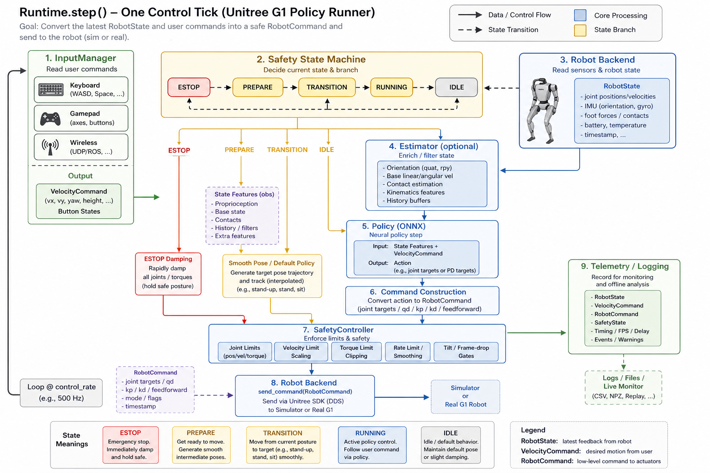
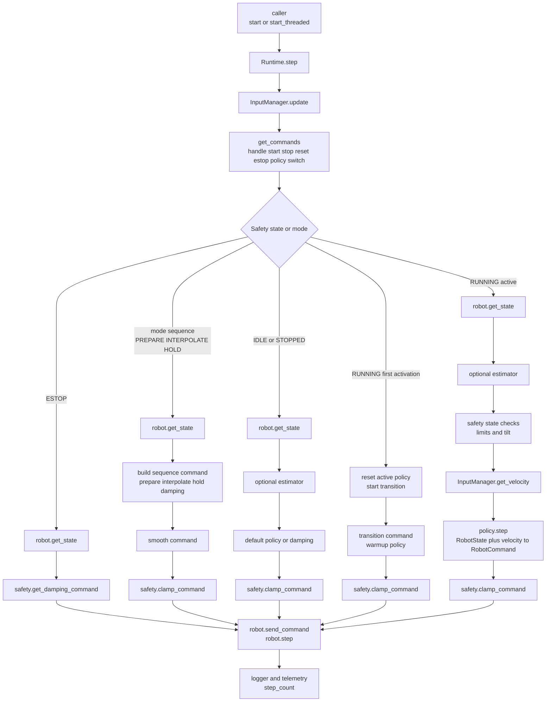

# Lesson 03: Runtime.step 一帧控制循环如何从 RobotState 变成 RobotCommand

本节接 Lesson 02 的最后状态：

```text
robot.connect() 已经完成
RealRobot 或 SimRobot 已经可以 get_state / send_command
Runtime 已经装配好 robot、policy、safety、input、logger
```

本节回答：

```text
Runtime.step() 每一帧到底做了什么？
```

先给结论：

```text
Runtime.step() 是本项目的原子控制 tick。
一帧里，它先读输入和安全状态，再选择控制分支，然后读 RobotState，必要时跑 policy，得到 RobotCommand，经过 safety clamp 后发送给 robot backend。
```

你可以把它记成：

```text
input -> state branch -> RobotState -> policy/default/prepare/damping -> RobotCommand -> safety -> robot
```

## 0. 先看直觉图



图片只帮助建立直觉。精确事实以后面的 Mermaid 和代码证据为准。

## 1. 本节边界

本节讲：

```text
Runtime.step()
  -> InputManager.update()
  -> handle commands
  -> 根据 SystemState / ControlMode 选择分支
  -> robot.get_state()
  -> optional estimator
  -> policy/default/prepare/damping 生成 RobotCommand
  -> safety.clamp_command()
  -> robot.send_command()
  -> robot.step()
  -> logger / telemetry
```

本节不展开：

- ONNX policy 内部 observation 怎么拼。
- `SafetyController` 每个限制阈值的具体数值。
- `RealRobot.send_command()` 内部怎么进入 `unitree_cpp`，这个已在 Lesson 02 讲过。

## 2. 精确数据流



这张图的重点不是记住每个分支，而是看清一个稳定模式：

```text
所有分支最后都要变成 RobotCommand。
RobotCommand 发出前都要经过 safety。
最后都交给 robot backend。
```

## 3. `Runtime.step()` 为什么叫原子控制 tick

`runtime.py` 文件开头直接说明：

```text
Runtime.step() is the atomic control unit
one tick of state read, policy inference, command building, and command send
```

它本身不负责睡眠和线程调度：

```text
step() 做一帧控制。
调用者负责多久调用一次。
```

真实运行方式有两类：

| 场景 | 谁控制循环 |
| --- | --- |
| headless / eval | 外层 tight loop 调 `runtime.step()` |
| gui / viser / real | `runtime.start_threaded()` 开后台线程，线程里调 `step()` 并 sleep |

所以你看 `Runtime.step()` 时，要把它理解成一帧，而不是整个程序。

## 4. 一帧第一步：先处理输入

每一帧开头先做：

```python
self._input_manager.update()
self._handle_commands(self._input_manager.get_commands())
```

`InputManager` 的职责是把多个输入源合并成统一接口：

```text
keyboard
gamepad
wireless
viser
```

它输出两类东西：

| 输出 | 用在哪里 |
| --- | --- |
| velocity command `[vx, vy, yaw_rate]` | 传给 policy.step |
| discrete commands | start、stop、reset、E-stop、policy next/prev |

这解释了为什么机器人启动后可能站着不动：

```text
Runtime 每帧都在跑。
但如果 safety state 还不是 RUNNING，或者 manual start gate 还没打开，active policy 不会直接接管。
```

## 5. 第二步：先看安全状态和控制模式

`Runtime.step()` 不是一上来就跑策略。它先分支。

主要分支是：

| 分支 | 什么时候进入 | 命令来源 |
| --- | --- | --- |
| `ESTOP` | `safety.state == ESTOP` | damping command |
| mode sequence | `_mode_sequence is not None` | prepare / interpolate / hold / damping |
| `IDLE/STOPPED` | `safety.state != RUNNING` | default policy 或 damping |
| `RUNNING first activation` | 刚从 stopped/idle 进入 running | reset policy，做 transition |
| `RUNNING active` | policy 已激活 | active policy |

这是一层很重要的心智模型：

```text
policy 不是每帧必跑。
只有进入 active running 分支后，才会跑 active policy。
```

## 6. ESTOP 分支：直接 damping

如果安全状态是 `ESTOP`：

```python
state = self.robot.get_state()
cmd = self.safety.get_damping_command(state)
self.robot.send_command(cmd)
self.robot.step()
return True
```

它不会跑 active policy。

这时的命令是：

```text
target position = current position
kp = 0
kd = kd_damp
```

目的不是继续完成任务，而是尽快进入阻尼状态。

## 7. PREPARE / INTERPOLATE / HOLD 分支：平滑过渡

真机 `real` 模式在 `main.py` 里会设置 prepare phase：

```text
runtime._mode_sequence = [(PREPARE, 5.0)]
```

进入 mode sequence 后，`Runtime.step()` 每帧：

```python
state = self.robot.get_state()
cmd = self._build_prepare_command(state)
cmd = self._smooth_command(cmd)
cmd = self.safety.clamp_command(cmd, state)
self.robot.send_command(cmd)
self.robot.step()
```

`PREPARE` 的作用是：

```text
从当前关节位置平滑走到 default policy 的 default_pos。
```

这里还有两个细节：

1. prepare 阶段会 warmup active policy 和 default policy。
2. prepare 完成后，如果 `require_manual_start` 为 True，会等待人工 start。

所以真机上“站着不动”常见原因之一是：

```text
prepare 已完成，但 Runtime 正在 awaiting_start。
```

这不是卡死，而是安全门没打开。

## 8. IDLE / STOPPED 分支：默认策略或阻尼

如果安全状态不是 `RUNNING`，Runtime 进入 idle/stopped 分支：

```python
state = self.robot.get_state()
if estimator:
    estimator.update(state)
    state = estimator.populate_robot_state(state)
...
if idle_damping:
    cmd = damping
elif default_policy:
    cmd = default_policy.step(state, np.zeros(3))
else:
    cmd = damping
cmd = safety.clamp_command(cmd, state)
robot.send_command(cmd)
robot.step()
```

这里的关键点：

```text
IDLE/STOPPED 不是完全不发命令。
它可能继续运行 default policy，让机器人保持站姿。
```

这就是为什么项目里有两个 policy 概念：

| policy | 用途 |
| --- | --- |
| default policy | idle/stopped/prepare/fallback 的站姿或默认控制 |
| active policy | 用户通过 `--policy` 指定的主要任务策略 |

## 9. RUNNING 第一次激活：先 reset，再 transition

当安全状态进入 `RUNNING`，但 `_policy_active` 还是 False 时，Runtime 不会立刻粗暴切到 active policy。

它会：

```python
self._policy_active = True
self.policy.reset()
self._step_count = 0
target_pos = self.policy.starting_pos.copy()
target_kp = self.policy.stiffness.copy()
target_kd = self.policy.damping.copy()
self._start_transition(...)
```

这一步的目的：

```text
让机器人先从当前姿态平滑过渡到 active policy 期望的 starting_pos 和 gains。
```

过渡阶段每帧：

```python
self.policy.warmup(state, np.zeros(3))
cmd = self._transition_step_command()
cmd = safety.clamp_command(cmd, state)
robot.send_command(cmd)
robot.step()
```

也就是说，transition 阶段会 warmup policy，但发出去的是插值命令，不是 policy 的正式 action。

## 10. RUNNING active 分支：真正策略控制

当 prepare 和 transition 都结束，Runtime 才进入真正的 active policy 分支。

核心代码是：

```python
state = self.robot.get_state()
if estimator:
    estimator.update(state)
    state = estimator.populate_robot_state(state)

if self.safety.check_state_limits(state):
    return True
if not self.safety.check_tilt(state.imu_quaternion):
    return True

vel_cmd = self._input_manager.get_velocity()
cmd = self.policy.step(state, vel_cmd)
cmd = self.safety.clamp_command(cmd, state)
self.robot.send_command(cmd)
self.robot.step()
```

这就是最核心的一帧：

```text
RobotState + velocity command
  -> policy.step
  -> RobotCommand
  -> safety clamp
  -> robot backend
```

对于真机：

```text
robot.send_command(cmd)
  -> RealRobot.send_command(cmd)
  -> unitree_cpp.set_gains(...)
  -> unitree_cpp.step(joint_positions)
  -> rt/lowcmd
```

对于仿真：

```text
robot.send_command(cmd)
  -> SimRobot 保存/应用命令
robot.step()
  -> MuJoCo 物理推进
```

## 11. policy.step 做什么，Runtime 不关心细节

`Policy` 基类规定：

```python
step(state, velocity_command) -> RobotCommand
```

并明确说明：

```text
Each policy subclass owns its observation format, control law, action scaling, and gains.
Runtime only calls policy.step(...) and receives a complete RobotCommand.
```

这很关键：

```text
Runtime 不拼 observation。
Runtime 不解释 ONNX action。
Runtime 只要求 policy 返回完整 RobotCommand。
```

所以不同策略可以有不同 observation 格式、action 缩放、关节映射，只要最终交回统一的 `RobotCommand`。

## 12. safety.clamp_command 是发命令前的最后闸门

无论命令来自：

```text
damping
prepare
transition
default policy
active policy
```

发出去前都要经过：

```python
cmd = self.safety.clamp_command(cmd, state)
```

`SafetyController.clamp_command()` 会做这些事情：

```text
joint position limits
joint velocity limits
torque limits
PD torque-aware position clamp
```

这说明：

```text
policy 算出来的命令不是直接裸发给机器人。
Runtime 会先让 safety 过滤一遍。
```

## 13. robot.step 在 sim 和 real 里含义不同

每个分支发完命令后都会调用：

```python
self.robot.step()
```

但这个接口在不同后端含义不同：

| 后端 | `send_command` | `step` |
| --- | --- | --- |
| `SimRobot` | 保存/应用控制命令 | 推进 MuJoCo 物理 |
| `RealRobot` | 发给 `unitree_cpp` | no-op |

所以不要误解成真机上 Python 每次 `robot.step()` 都在推进机器人。真机世界自己在走，`unitree_cpp` 和硬件控制板负责底层执行。

## 14. logger 和 telemetry 是观察窗口

active policy 分支末尾会记录：

```text
timestamp
RobotState
observation
action
RobotCommand
system_state
velocity_command
timing
raw_state
estimator_info
```

然后更新 telemetry：

```text
loop_hz
sim_hz
inference_ms
loop_ms
base_height
base_vel
system_state
step_count
```

这些不是控制决策本体，而是你调试和复盘时的观察窗口。

## 15. 异常会触发 E-stop

`Runtime.step()` 的主体包在 `try/except` 里。

如果控制循环里抛异常：

```python
print(f"[runtime] EXCEPTION in control loop: {exc}")
self.safety.estop()
```

测试里也覆盖了：`policy.step()` 抛 `RuntimeError` 时，Runtime 会进入 E-stop。

这说明项目的设计倾向是：

```text
控制循环异常不要继续假装运行。
先进入安全状态。
```

## 16. 代码证据地图

| 代码位置 | 证据 | 含义 |
| --- | --- | --- |
| `src/unitree_launcher/control/runtime.py:3` | `Runtime.step()` is the atomic control unit | 一帧控制 tick 的定义 |
| `src/unitree_launcher/control/runtime.py:75` | `Runtime.__init__` | Runtime 持有 robot、policy、safety、config、input |
| `src/unitree_launcher/control/runtime.py:105` | `_dt = 1.0 / policy_frequency` | 控制频率来自 config |
| `src/unitree_launcher/control/runtime.py:207` | `start()` | 初始化 pipeline，不启动线程 |
| `src/unitree_launcher/control/runtime.py:240` | `start_threaded()` | 后台线程循环调用 step |
| `src/unitree_launcher/control/runtime.py:299` | `_handle_commands` | 处理 start/stop/reset/E-stop/policy switch |
| `src/unitree_launcher/control/runtime.py:670` | `def step(self)` | 一帧控制入口 |
| `src/unitree_launcher/control/runtime.py:690` | `_input_manager.update()` | 每帧先更新输入 |
| `src/unitree_launcher/control/runtime.py:692` | `_handle_commands(...)` | 输入命令影响 safety/runtime 状态 |
| `src/unitree_launcher/control/runtime.py:695` | `ESTOP` 分支 | E-stop 发送 damping |
| `src/unitree_launcher/control/runtime.py:705` | `_mode_sequence` 分支 | prepare/interpolate/hold 自动序列 |
| `src/unitree_launcher/control/runtime.py:715` | `PREPARE` | 准备阶段构造平滑姿态命令 |
| `src/unitree_launcher/control/runtime.py:741` | `_smooth_command` | 模式序列命令做 slew-rate limit |
| `src/unitree_launcher/control/runtime.py:742` | `safety.clamp_command` | 发命令前安全裁剪 |
| `src/unitree_launcher/control/runtime.py:779` | `state != RUNNING` | idle/stopped 分支 |
| `src/unitree_launcher/control/runtime.py:796` | `_default_policy.step` | 非 active 时可运行默认策略 |
| `src/unitree_launcher/control/runtime.py:810` | `not _policy_active` | active policy 首次激活 |
| `src/unitree_launcher/control/runtime.py:854` | `policy.reset()` | 激活前重置策略状态 |
| `src/unitree_launcher/control/runtime.py:867` | `_start_transition(...)` | 从当前姿态过渡到 policy starting pose |
| `src/unitree_launcher/control/runtime.py:874` | `_transition_active` | transition 分支 |
| `src/unitree_launcher/control/runtime.py:884` | `policy.warmup(...)` | transition 阶段 warmup policy |
| `src/unitree_launcher/control/runtime.py:894` | `robot.get_state()` | active 分支读取机器人状态 |
| `src/unitree_launcher/control/runtime.py:896` | estimator update/populate | 可选状态估计器补全 base 状态 |
| `src/unitree_launcher/control/runtime.py:900` | `check_state_limits` | 检查测量状态是否越界 |
| `src/unitree_launcher/control/runtime.py:902` | `check_tilt` | 检查倾倒 |
| `src/unitree_launcher/control/runtime.py:907` | `get_velocity()` | 读取速度命令 |
| `src/unitree_launcher/control/runtime.py:908` | `policy.step(state, vel_cmd)` | active policy 生成 RobotCommand |
| `src/unitree_launcher/control/runtime.py:928` | `safety.clamp_command` | active policy 命令安全裁剪 |
| `src/unitree_launcher/control/runtime.py:929` | `robot.send_command(cmd)` | 命令交给 robot backend |
| `src/unitree_launcher/control/runtime.py:932` | `robot.step()` | 后端推进一步，real 为 no-op |
| `src/unitree_launcher/control/runtime.py:939` | logger | active 分支记录数据 |
| `src/unitree_launcher/control/runtime.py:972` | `_update_telemetry` | 更新遥测 |
| `src/unitree_launcher/control/runtime.py:976` | exception handler | 异常触发 E-stop |
| `src/unitree_launcher/control/safety.py:26` | `SystemState` | IDLE/RUNNING/STOPPED/ESTOP |
| `src/unitree_launcher/control/safety.py:33` | `ControlMode` | HOLD/DEFAULT/ACTIVE_POLICY/DAMPING/PREPARE/TRANSITION/INTERPOLATE |
| `src/unitree_launcher/control/safety.py:226` | `clamp_command` | 命令限制和 torque-aware clamp |
| `src/unitree_launcher/policy/base.py:3` | policy owns obs/control law/action scaling/gains | policy 内部细节不属于 Runtime |
| `src/unitree_launcher/policy/base.py:61` | `step(state, velocity_command) -> RobotCommand` | Runtime 和 policy 的核心契约 |
| `src/unitree_launcher/controller/input.py:33` | `InputManager` | 合并多个输入源 |
| `src/unitree_launcher/controller/input.py:48` | `get_velocity` | 第一个非零速度命令胜出 |
| `src/unitree_launcher/controller/input.py:56` | `get_commands` | 合并离散命令 |
| `tests/test_runtime.py:122` | `test_estop_sends_damping` | 测试 ESTOP 发送 damping |
| `tests/test_runtime.py:141` | exception triggers E-stop | 测试 policy 异常触发 E-stop |
| `tests/test_runtime.py:169` | telemetry updates | 测试 telemetry 更新 |
| `tests/test_runtime.py:188` | key handling | 测试输入命令影响 runtime/safety 状态 |

## 17. 你现在应该记住什么

1. `Runtime.step()` 是一帧控制，不是整个程序。
2. 每帧先处理输入命令，再根据 safety state 和 control mode 选分支。
3. `ESTOP` 不跑 policy，直接发 damping。
4. `PREPARE/TRANSITION` 是为了平滑进入 policy，不是正式策略执行。
5. `IDLE/STOPPED` 也可能发 default policy 命令，让机器人站稳。
6. 真正 active policy 分支是 `robot.get_state()` -> `policy.step(state, vel_cmd)` -> `RobotCommand`。
7. 所有命令发出前都要经过 `safety.clamp_command()`。
8. `robot.send_command()` 把统一命令交给具体后端，sim 和 real 后端实现不同。
9. `robot.step()` 在 sim 里推进物理，在 real 里是 no-op。
10. 异常会触发 E-stop。

## 18. 自测题

请你尝试不用看上文回答：

1. 为什么说 `Runtime.step()` 是原子控制 tick？
2. 每帧为什么先处理 `InputManager`？
3. `ESTOP` 分支为什么不跑 active policy？
4. `PREPARE` 和 `TRANSITION` 的区别是什么？
5. `IDLE/STOPPED` 为什么可能还会发命令？
6. active policy 正式执行时，`RobotState` 和 `velocity command` 分别从哪里来？
7. `policy.step()` 返回的是什么？
8. `safety.clamp_command()` 为什么要放在 `robot.send_command()` 前面？
9. `robot.step()` 在真机和仿真里的意义有什么不同？
10. 如果 `policy.step()` 抛异常，Runtime 做什么？

## 19. 下一节

下一节建议继续钻：

```text
Lesson 04: Policy.step 如何把 RobotState 和速度命令变成 RobotCommand
```

也就是从本节的：

```python
cmd = self.policy.step(state, vel_cmd)
```

继续往策略内部看。
