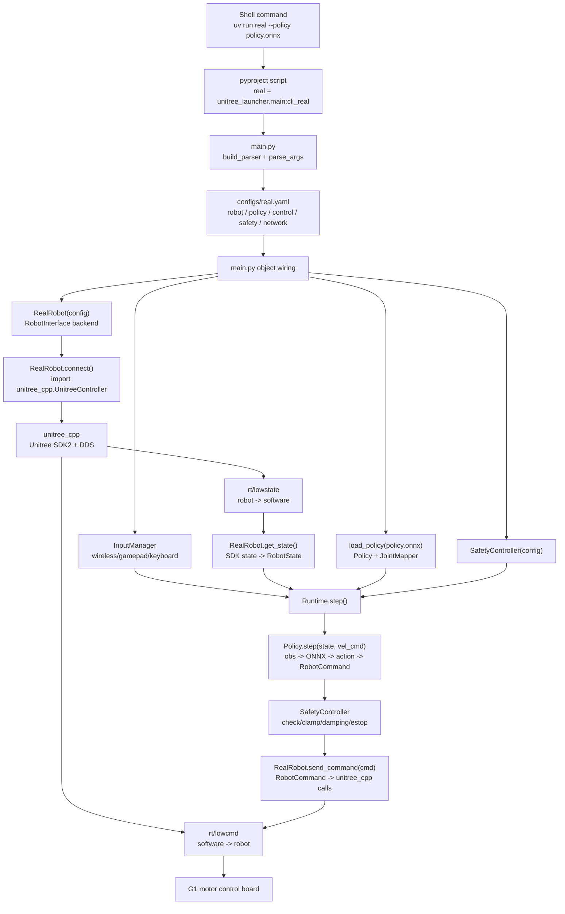

# Robot SDK Porting Workflow: 从 G1 到其他机器人

这篇教程回答一个问题：

> 如果我已经有别的机器人的 SDK，想把这个项目的真机部署链路换到那台机器人上，我应该看懂哪些数据流、替换哪些组件？

先给结论：

```text
想换机器人，不是先换 ONNX。
最先要换的是“硬件 SDK 适配层”：把别人的 SDK 状态翻译成 RobotState，把 RobotCommand 翻译成别人的 SDK 命令。
```

当前项目以 Unitree G1 为例，完整链路是：

```text
uv run real --policy xxx.onnx
  -> main.py 解析 CLI 和 configs/real.yaml
  -> 创建 RealRobot / Policy / SafetyController / Runtime
  -> RealRobot.connect() 创建 unitree_cpp.UnitreeController
  -> Runtime.step() 周期循环
  -> RobotState -> Policy.step() -> RobotCommand
  -> SafetyController clamp / damping / estop
  -> RealRobot.send_command()
  -> unitree_cpp -> Unitree SDK2 / DDS -> G1 motor control board
```

## 1. 总数据流

下面这张图是事实链路图，源于当前代码，不是概念图。



你要记住两条边界：

```text
上层边界：Policy.step(state, velocity_command) -> RobotCommand
底层边界：RobotInterface.get_state() / send_command()
```

换机器人时，最关键的是守住这两个边界。

## 2. 当前 G1 链路每层在干什么

| 层 | 目的 | 输入 | 输出 | 当前 G1 实现 |
| --- | --- | --- | --- | --- |
| CLI 启动层 | 把命令变成 `args` | `uv run real --policy ...` | `args.mode`, `args.policy`, `args.interface` | `main.py`, `pyproject.toml` |
| 配置层 | 给运行时提供默认参数 | `configs/real.yaml` | `Config` | `configs/real.yaml` |
| 硬件后端层 | 连接真机 SDK | `Config.network.interface` | 可读写的 robot backend | `RealRobot` |
| SDK 桥层 | 处理 Unitree 通信细节 | `net_if`, topic, control mode | `UnitreeController` | `unitree_cpp` |
| 状态标准化 | 把 SDK 状态变成项目状态 | Unitree motor/IMU state | `RobotState` | `RealRobot.get_state()` |
| 策略层 | 把状态变成命令 | `RobotState`, velocity command | `RobotCommand` | `Policy.step()` |
| 安全层 | 检查和限制命令 | `RobotState`, `RobotCommand` | safe `RobotCommand` | `SafetyController` |
| 命令下发 | 把项目命令变成 SDK 命令 | `RobotCommand` | low-level command | `RealRobot.send_command()` |

这就是你以后读任何机器人项目都可以复用的框架：

```text
命令入口 -> 配置 -> 机器人后端 -> SDK -> 标准状态 -> 策略 -> 标准命令 -> SDK 命令 -> 电机
```

## 3. G1 的硬件 SDK 适配点

当前 G1 真机后端是 `RealRobot`。

它在 `connect()` 里导入：

```python
from unitree_cpp import UnitreeController
```

然后构造：

```python
config_dict = {
    "net_if": self._iface_name,
    "control_dt": 0.02,
    "msg_type": "hg",
    "control_mode": "position",
    "lowcmd_topic": "rt/lowcmd",
    "lowstate_topic": "rt/lowstate",
    "num_dofs": self._n_dof,
}
self._controller = UnitreeController(config_dict)
```

这一步的含义是：

```text
Python RealRobot
  -> unitree_cpp.UnitreeController
  -> Unitree SDK2 / DDS
  -> G1 robot
```

后面每帧有两个方向。

状态方向：

```text
Unitree LowState
  -> unitree_cpp.get_robot_state()
  -> RealRobot.get_state()
  -> RobotState
```

命令方向：

```text
RobotCommand
  -> RealRobot.send_command()
  -> unitree_cpp.set_gains(kp, kd)
  -> unitree_cpp.step(joint_positions)
  -> Unitree lowcmd
```

所以 `RealRobot` 的本质不是“机器人智能”，而是翻译器：

```text
Unitree SDK 状态 <-> 项目统一状态/命令
```

## 4. Runtime 每一帧的数据流

`Runtime.step()` 是项目的控制原子单位。

正常 RUNNING 时，它做的是：

```text
1. input_manager.update()
2. robot.get_state()
3. safety.check_state_limits(state)
4. safety.check_tilt(state.imu_quaternion)
5. vel_cmd = input_manager.get_velocity()
6. cmd = policy.step(state, vel_cmd)
7. cmd = safety.clamp_command(cmd, state)
8. robot.send_command(cmd)
9. robot.step()
```

注意最后的 `robot.step()`：

```text
SimRobot.step() 真的推进 MuJoCo 物理。
RealRobot.step() 是 no-op，因为硬件和 unitree_cpp 已经在底层发命令。
```

这就是为什么项目能同时支持仿真和真机：上层只认识 `RobotInterface`，不关心底层是 MuJoCo 还是 G1。

## 5. Policy 层的数据流

`Policy` 的统一合同是：

```python
Policy.step(state: RobotState, velocity_command: np.ndarray) -> RobotCommand
```

以 `BeyondMimicPolicy` 为例：

```text
RobotState
  -> build_observation()
  -> ONNX Runtime session.run({"obs": obs, "time_step": t})
  -> raw action
  -> smooth / clip / scale
  -> target_q = default_joint_pos + action
  -> JointMapper.policy_to_robot()
  -> RobotCommand(joint_positions, kp, kd)
```

这里有一个关键点：

```text
Policy 输出的不是 SDK 命令。
Policy 输出的是项目标准 RobotCommand。
```

这样做的价值是：如果未来换机器人，但控制模式仍能表示为某种 `RobotCommand`，上层策略可以少改。

## 6. JointMapper 为什么是换机器人时的高风险点

机器人 SDK 通常用自己的关节顺序。策略训练时也有自己的关节顺序。

`JointMapper` 负责：

```text
robot-native order -> policy order
policy order -> robot-native order
policy gains -> robot full DOF gains
```

如果你换机器人，这一层必须重新审查。错误例子：

```text
策略以为 action[0] 是 left_hip_pitch
新机器人 SDK 以为 motor[0] 是 waist_yaw
```

这会让机器人收到完全错误的动作。

所以换机器人时，关节映射的优先级非常高，仅次于 SDK 能不能通信。

## 7. 如果我有另一个机器人 SDK，应该换哪些

假设你现在有一个新机器人 SDK，叫 `newbot_sdk`。迁移路线不是直接改 policy，而是按下面顺序。

### Step 1：先理解新 SDK 的最小控制面

你要从 SDK 文档或例程里找出六件事：

| 问题 | 你要找到的 SDK 能力 |
| --- | --- |
| 怎么连接机器人？ | init/connect/channel open |
| 怎么读状态？ | joint position, velocity, torque, IMU, timestamp |
| 怎么发命令？ | position/velocity/torque/PD command |
| 命令频率是多少？ | 50Hz, 200Hz, 1kHz, watchdog timeout |
| 怎么进入安全模式？ | damping, passive, brake, estop |
| 怎么知道通信失败？ | timeout, heartbeat, frame counter |

如果这六件事不清楚，不要开始迁移上层策略。

### Step 2：新增一个机器人后端

最自然的做法是新增：

```text
src/unitree_launcher/robot/newbot_robot.py
```

实现：

```python
class NewBotRobot(RobotInterface):
    def connect(self) -> None:
        ...

    def get_state(self) -> RobotState:
        ...

    def send_command(self, cmd: RobotCommand) -> None:
        ...

    def step(self) -> None:
        ...

    def reset(self, initial_state=None) -> None:
        ...

    @property
    def n_dof(self) -> int:
        ...
```

这一步是迁移的核心。你要做两种翻译。

状态翻译：

```text
newbot_sdk.State
  -> joint_positions
  -> joint_velocities
  -> joint_torques
  -> imu_quaternion
  -> imu_angular_velocity
  -> imu_linear_acceleration
  -> RobotState
```

命令翻译：

```text
RobotCommand
  -> newbot_sdk motor command
  -> send / publish / write
```

### Step 3：处理 SDK 是 Python 还是 C++

如果新 SDK 是 Python SDK，最简单：

```python
import newbot_sdk

class NewBotRobot(RobotInterface):
    def connect(self):
        self.client = newbot_sdk.Client(...)
```

如果新 SDK 是 C++ SDK，有三条路线：

| 路线 | 形式 | 适合情况 |
| --- | --- | --- |
| pybind 包装 | 类似 `unitree_cpp` | 想保留本项目 Python Runtime |
| 独立 C++ 控制器 | 类似 `mjlab` 的 `g1_ctrl` | 想把控制循环也放进 C++ |
| C++ 进程 + IPC | Python 通过 socket/shared memory 和 C++ 通信 | SDK 难包装，但还想保留 Python 上层 |

如果你的目标是复用这个项目，优先选：

```text
C++ SDK -> pybind wrapper -> NewBotRobot imports wrapper
```

也就是模仿当前：

```text
Unitree SDK2 -> unitree_cpp -> RealRobot
```

### Step 4：新增机器人配置和关节表

当前安全层和 joint mapper 都依赖机器人关节定义。

新机器人至少需要：

```text
joint names
joint order
n_dof
default pose
position limits
velocity limits
torque limits
kp/kd defaults
controlled joints
non-controlled joints
```

现在这些 G1 信息分散在：

```text
src/unitree_launcher/config.py
configs/real.yaml
policy metadata
```

迁移时要把 G1 特化常量替换成新机器人版本，或者把配置系统扩展为多机器人。

### Step 5：确认策略 contract 是否还能用

这是最容易被低估的一步。

你不能假设 G1 的 ONNX 能直接控制新机器人。必须确认：

```text
obs 维度是否一致？
obs 每一项含义是否一致？
动作维度是否一致？
动作单位是否一致？
动作顺序是否一致？
输出是目标关节角、残差动作、速度还是力矩？
训练频率是否一致？
默认姿态是否一致？
```

如果新机器人和 G1 形态差异大，通常要重新训练或至少重新导出适配新机器人的 policy。

但如果新机器人只是同系列、同 DoF、同关节顺序，可能可以通过 `JointMapper`、默认姿态和限位配置降低改动。

### Step 6：先做 read-only probe，再做低风险命令

新 SDK 接进来后，验证顺序应该是：

```text
1. connect() 能成功
2. get_state() 能稳定返回 RobotState
3. 只读打印 joint/IMU/timestamp
4. send damping/zero/hold 命令
5. 小幅单关节测试
6. prepare phase
7. policy warmup
8. 低风险 policy 运行
```

不要直接：

```text
接好 SDK -> 跑 learned policy
```

## 8. 换机器人时哪些能复用，哪些必须换

| 组件 | 能否复用 | 原因 |
| --- | --- | --- |
| `main.py` CLI 思路 | 大部分可复用 | 命令解析和对象装配模式通用 |
| `Runtime` | 大部分可复用 | 它依赖 `RobotInterface`，不是直接依赖 Unitree |
| `Policy` 抽象 | 可复用 | 输入 `RobotState`，输出 `RobotCommand` |
| `SafetyController` 思路 | 可复用，参数必须换 | 安全状态机通用，限位强机器人相关 |
| `JointMapper` | 可复用，映射数据必须换 | 映射算法通用，关节表必须重做 |
| `RealRobot` | 不可直接复用 | 它是 Unitree G1 / unitree_cpp 专用 |
| `unitree_cpp` | 不可复用 | 它绑定 Unitree SDK2 |
| `configs/real.yaml` | 只能当模板 | 里面的 G1 网络、DoF、安全配置要换 |
| `scripts/build_cpp_backend.sh` | 只能当模板 | 新 SDK 的构建和安装方式不同 |
| G1 policy ONNX | 通常不能复用 | obs/action/身体结构绑定训练环境 |

## 9. 最小迁移工作包

如果你真的要把这个项目迁移到新机器人，最小工作包应该是：

```text
1. 新 SDK read-only probe
2. NewBotRobot 实现 RobotInterface
3. NewBotRobot 单元测试：mock SDK state -> RobotState
4. NewBotRobot 单元测试：RobotCommand -> SDK command
5. 新 robot variant / joint table / limits
6. 新 configs/newbot_real.yaml
7. main.py 支持选择 NewBotRobot
8. 低风险命令测试：damping / hold / 单关节小幅运动
9. 策略 contract 检查
10. sim 或离线 replay 验证
11. 真机保护条件下测试
```

如果只想做概念验证，前四步就够你判断 SDK 是否能接进这个项目。

## 10. G1 作为模板时的迁移对照表

| G1 当前做法 | 换机器人时要替换成 |
| --- | --- |
| `unitree_cpp.UnitreeController(config_dict)` | `newbot_sdk.Client(...)` 或 `newbot_cpp.NewBotController(...)` |
| `rt/lowstate` | 新 SDK 的状态通道 |
| `rt/lowcmd` | 新 SDK 的命令通道 |
| `ms.q[:n_dof]` | 新 SDK 的关节位置数组 |
| `ms.dq[:n_dof]` | 新 SDK 的关节速度数组 |
| `ms.tau_est[:n_dof]` | 新 SDK 的力矩估计或可用替代值 |
| `imu_state.quaternion` | 新 SDK 的 IMU 四元数，注意 wxyz/xyzw 顺序 |
| `set_gains(kp, kd)` | 新 SDK 设置 PD gain 的接口 |
| `step(joint_positions)` | 新 SDK 发送 command 的接口 |
| `L2+B` hardware damping | 新机器人硬件级急停/刹车/阻尼方式 |

特别注意 IMU 四元数顺序：

```text
本项目 RobotState 期望 imu_quaternion 是 wxyz。
很多 SDK 会给 xyzw。
```

这个错了，倾倒检测和策略观测都会错。

## 11. 一个新机器人后端的伪代码

```python
from unitree_launcher.robot.base import RobotInterface, RobotState, RobotCommand


class NewBotRobot(RobotInterface):
    def __init__(self, config):
        self._iface = config.network.interface
        self._n_dof = len(config.robot.joints)
        self._client = None

    def connect(self):
        import newbot_sdk
        self._client = newbot_sdk.Client(interface=self._iface)
        self._client.connect()
        if not self._client.self_check():
            raise RuntimeError("NewBot SDK self-check failed")

    def get_state(self):
        raw = self._client.read_state()
        return RobotState(
            timestamp=raw.timestamp,
            joint_positions=raw.joint_q,
            joint_velocities=raw.joint_dq,
            joint_torques=raw.joint_tau,
            imu_quaternion=convert_to_wxyz(raw.imu_quat),
            imu_angular_velocity=raw.gyro,
            imu_linear_acceleration=raw.accel,
            base_position=np.full(3, np.nan),
            base_velocity=np.full(3, np.nan),
            sdk_state=None,
        )

    def send_command(self, cmd: RobotCommand):
        sdk_cmd = self._client.make_position_pd_command(
            q=cmd.joint_positions,
            dq=cmd.joint_velocities,
            kp=cmd.kp,
            kd=cmd.kd,
            tau=cmd.joint_torques,
        )
        self._client.send(sdk_cmd)

    def step(self):
        pass

    def reset(self, initial_state=None):
        pass

    @property
    def n_dof(self):
        return self._n_dof
```

这段不是要你直接复制，而是让你看清迁移核心：

```text
SDK state -> RobotState
RobotCommand -> SDK command
```

## 12. 代码证据表

| 事实 | 证据 |
| --- | --- |
| `uv run real` 进入 `cli_real()` | `pyproject.toml`, `src/unitree_launcher/main.py` |
| `real` 子命令默认使用 `configs/real.yaml` 和 `eth0` | `src/unitree_launcher/main.py` 的 real parser |
| real 模式创建 `RealRobot(config)` | `src/unitree_launcher/main.py` |
| `Runtime` 组合 robot/policy/safety/input | `src/unitree_launcher/main.py` |
| `Runtime.step()` 是控制原子单位 | `src/unitree_launcher/control/runtime.py` |
| `Policy.step()` 输出完整 `RobotCommand` | `src/unitree_launcher/policy/base.py` |
| `RealRobot.connect()` 导入 `unitree_cpp.UnitreeController` | `src/unitree_launcher/robot/real_robot.py` |
| `RealRobot.get_state()` 把 SDK 状态转成 `RobotState` | `src/unitree_launcher/robot/real_robot.py` |
| `RealRobot.send_command()` 调 `set_gains` 和 `step` | `src/unitree_launcher/robot/real_robot.py` |
| `RobotInterface` 定义可替换 backend 的边界 | `src/unitree_launcher/robot/base.py` |
| `JointMapper` 处理 policy order 和 robot order | `src/unitree_launcher/policy/joint_mapper.py` |
| `SafetyController` 管系统状态和安全限制 | `src/unitree_launcher/control/safety.py` |
| `build_cpp_backend.sh` 先安装 Unitree SDK2，再构建 `unitree_cpp` | `scripts/build_cpp_backend.sh` |
| `deploy_to_robot.sh` 只同步代码和检查 `unitree_cpp` | `scripts/deploy_to_robot.sh` |

## 13. 你现在应该形成的判断标准

以后你看到一个新机器人 SDK，不要先问“能不能跑 policy”。先问：

```text
1. 我能不能稳定读状态？
2. 我能不能稳定发最简单的安全命令？
3. 我能不能把 SDK 状态无损翻译成 RobotState？
4. 我能不能把 RobotCommand 正确翻译成 SDK command？
5. 关节顺序、单位、限位、IMU 坐标是否全部对齐？
6. 硬件急停和软件急停分别是什么？
7. 策略 obs/action contract 是否适合这台机器人？
```

只要你能回答这些问题，你就不是在“盲目部署”，而是在做有边界的机器人后端迁移。
